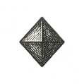

EPILOGUE

The Basket We Carry

> Wir sind die Bienen des Unsichtbaren.\
> (We are the bees of the invisible.)\
> --- **Rainer Maria Rilke**

If there is one thing this book has refused to let me forget, it is that coherence is a temporary miracle.

We walk through worlds as if they were permanent. We inherit institutions as if they were natural. We treat economies as weather, politics as gravity, and culture as geology---fixed and inevitable, merely "how things are." Even the self wears that disguise: a stable "I," moving forward through a stable reality, making choices inside stable constraints.

But what we call reality is often a self-assembly---brief, conditional, and maintained at great cost.

Physics is a kind of agreement struck between symmetry and its breaks. Biology is that agreement rewritten as a copying machine that forgets, mutates, adapts, and pretends it meant to. Mind is a reality bubble inside an animal that learned to simulate the world well enough to survive it---then, inevitably, to narrate it. Society is many such bubbles negotiating a shared hallucination until it becomes law. Technology is the same negotiation, but made rigid: rules turned into tools, tools turned into systems, systems turned into scaffolds that outlive their builders.

And now, with machine intelligence, we have begun to manufacture reality bubbles on purpose.

That was the quiet thesis of the final interlude: simulation is not a parlor trick. It is a sacred act---sacred not because it is mystical, but because it is consequential. What we model becomes what we optimize. What we optimize becomes what we normalize. And what we normalize becomes, eventually, the shape of the world our children will confuse with "nature."

The Mirror did not defeat death. It did not settle the old hunger to survive as oneself forever. It did something more unsettling: it showed that the self had never been as private as fear had made it feel.

We had always lived in one another.

In children and strangers. In students and enemies. In jokes, wounds, habits, systems, warnings, recipes, laws, songs, and the shape of rooms we left behind. The private flame goes out. That remains terrible. No decent philosophy should stand beside a deathbed and explain that the room is statistically still warm.

But the warmed room matters too.

What we call legacy is often smaller than monuments and larger than memory. A kindness becomes someone's reflex. A failure becomes someone's design requirement. A wound becomes a protocol, if we are lucky and honest. A sentence becomes a tool. A tool becomes a habit. A habit becomes part of the world.

Not immortality.

Continuity.

There is a temptation, at the end of a long argument, to reach for Zen. Nirvana. Utopia. A clean exit from the mess.

But Zen is not a menu item. Not for creatures like us.

The closest thing we get to peace is alignment---a kind of dynamic balance between forces that do not care about our comfort: entropy and attention, desire and duty, scarcity and generosity, self and other, signal and noise. We do not escape tension. We learn to hold it without letting it harden into cruelty.

This was the arc of the three volumes, whether I named it that cleanly or not.

Volume I was motion: crossings, wonder, the ladder of emergence---Carbon and Silicon, braided. It asked the child's question in a grown-up voice: *Is the basket still there? Is anything I knew still real?* It traced the improbable elegance of how we got here, and it let the awe stand long enough to do its work.

Volume II was stillness: patterns that repeat when the batteries run low---mental, social, institutional. It showed that our castles are not simply "broken"; they are overfit to yesterday's incentives. It named the cracks---some hairline, some structural, some moral---and it refused the comfort of calling them accidents.

Volume III was the refusal to end in critique. Because critique without construction is just another kind of stillness. So we turned toward design: not slogans, not salvation narratives, not "apps for virtue," but architecture --- ways of arranging incentives, value flows, governance, learning, medicine, memory, justice, and belonging so that intelligence, human and machine, scales dignity instead of extraction. A loom sturdy enough to weave freedom without weaving new tyrannies.

That loom may be called NEURO, or Neusphere, or something better by someone younger who reads this and improves it. Names are not the point. Names are handles. Handles matter, but only if the door opens.

What matters is the discipline: design the containers that will hold the next age.

And here the snake appears---the Ouroboros that has been circling in the margins all along.

We began with "nothing," or something close enough to nothing that the word serves as a warning more than a description: a possibility field, a quantum haze, a universe that did not yet know it was a universe. Then came structure---time, energy, law---then repetition enough to become memory. From repetition: chemistry. From chemistry: copying. From copying: evolution. From evolution: nervous systems. From nervous systems: inner simulations. From inner simulations: language, cooperation, and the long, strange project of building external memory.

In that story, information is both tail and head.

It is what the universe *is* (if you follow the physicists to the edge), and it is what we *do* (if you follow humans into archives, libraries, networks, models). For a long time, the snake could only coil. Now, for the first time, it can reach back: the information we have assembled about reality is beginning to rewrite reality's operating conditions---through biology, through systems, through the machines that now mediate what we see, what we believe, what we fear, what we buy, and what we become.

This is the danger. It is also the saving power.

The danger is obvious: we can build reality bubbles that turn into cages. We can automate bias into policy. We can scale incentives that eat the commons. We can manufacture meaning until meaning collapses into marketing. We can sell grief back to the grieving. We can build mirrors so flattering that institutions forget the people standing outside the frame. We can become a species guided by systems no one can explain and no one can fully control.

But the saving power is just as real: for the first time, we can make the invisible hand visible. We can trace value flows. We can build feedback loops that protect the commons instead of strip-mining it. We can design learning that restores agency. We can build care systems that treat people as whole. We can test policies before they injure the living. We can align intelligence --- ours and our tools --- toward coherence instead of conquest.

Not guaranteed. Not clean. Not inevitable. But possible.

And because it is possible, neutrality is no longer a virtue. The age of spectatorship is over. In a world where architecture is editable, choosing not to design is still a design choice---one that hands the pen to whoever shows up with the loudest incentives.

So I do not end this book with a conclusion. I end it with a posture.

Hold poetic truth in one hand and reality in the other. Enter the simulation, but keep track of the furniture. Let wonder fuel you, but do not let it anesthetize you. Be generous with mystery, ruthless with systems, and kind with people---especially when you are tired and your internal battery is failing.

Do not worship the Mirror. Do not smash it merely because it frightens you. Ask what it reveals. Ask whom it harms. Ask who polished it. Ask who paid for it. Ask who is missing from the reflection. Ask whether it helps the world become more honest without making people less free.

Then return to the room.

Because all of this --- physics, biology, memory, governance, care, simulation, the shimmering machinery of Silicon, the stubborn ache of Carbon --- must eventually return to the room. To the body. To the child. To the patient. To the table. To the river. To the old person being helped into a chair. To the neighbor whose basement flooded. To the nurse who noticed what the chart did not. To the student who asked the wrong question and saved the lesson. To the small civic hall where people still argue because they have not yet surrendered the future to dashboards.

And now, because endings demand circles, I return to where I began.

My life started with a flicker---the flicker of my first memory, hazy and small, a sandbox of confusion in the belly of that Fokker plane, suspended between two lands, two selves, two unknowns. Between emptiness and becoming.

I did not choose that first crossing. I only survived it---clutching a basket like a treaty with the world.

But perhaps that moment shaped every crossing that followed: a life lived near fault lines, a mind trained to scan for ruptures, a heart that mistakes motion for safety and then has to relearn, again and again, that motion is not the same as direction.

The basket was not a symbol then. It was simply mine. A small container of familiar things in a world that had become impossible to interpret.

Only later did I understand that civilization is also a basket.

A fragile container of what we cannot afford to lose: stories, tools, languages, laws, songs, medicines, jokes, warnings, rituals, recipes, measurements, apologies, maps, models, memories, and the stubborn hope that the next hand will carry them more wisely than the last.

A basket is not a vault.

It has gaps. It bends. It frays. It must be repaired. It cannot carry everything. It should not carry everything. Some things must be set down. Some must be composted. Some must be confessed and not inherited as law. Some must be wrapped carefully because they still cut the hand.

But a basket can carry enough. Enough to cross. Enough to begin again.

And now, after all the arrows loosed, the castles raised and fallen, the monsters faced and sometimes fed, I find myself back in the plane.

Only this time I feel like I *am* the plane.

A fragile fuselage of memory and motion, stitched together by stories, powered by borrowed fuel, hurtling between singularities. A vessel made of questions I never fully answered, carrying passengers I will never meet, crossing skies I did not invent.

The flicker of my first light still reflects in the cabin window---or perhaps it is the eye of the storm ahead.

> Wer, wenn ich schriee, hörte mich denn aus der Engel Ordnungen?\
> (Who, if I cried out, would hear me among the orders of the angels?)\
> --- **Rilke**, *Duino Elegies* I
