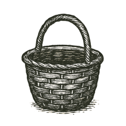

EPILOGUE

The Basket We Carry

> Wir sind die Bienen des Unsichtbaren.\
> (We are the bees of the invisible.)\
> --- **Rainer Maria Rilke**

If this book has refused to let me forget one thing, it is that coherence is a temporary miracle.

We walk through the world as if it were permanent. We inherit institutions as if they were natural, and treat economies as weather, politics as gravity and culture as geology: fixed, inevitable, simply how things are. Even the self wears that disguise, a stable "I" moving through a stable reality and making choices inside stable constraints. But what we call reality is usually a self-assembly, brief, conditional, and maintained at great cost. Physics is an agreement struck between symmetry and its breaks; biology rewrites that agreement as a copying machine that forgets, mutates, adapts, and pretends it meant to. A mind is a reality bubble inside an animal that learned to simulate the world well enough to survive it (and then, inevitably, to narrate it). A society is many such bubbles negotiating a shared hallucination until it becomes law, and technology is the same negotiation made rigid: rules turned into tools, tools into systems, systems into scaffolds that outlive their builders.

And now, with machine intelligence, we have started manufacturing reality bubbles on purpose. That was the quiet thesis of the final interlude: simulation is a sacred act, sacred because it is consequential rather than because it is mystical. What we model, we optimize; what we optimize, we normalize; and what we normalize eventually becomes the world our children mistake for nature.

The Mirror did not defeat death. It did not settle the old hunger to survive as oneself forever. What it did was more unsettling: it showed that the self had never been as private as fear had made it feel. We had always lived in one another, in children and strangers, students and enemies, in jokes, wounds, habits, recipes and laws, and in the shape of the rooms we left behind. The private flame goes out, and that remains terrible; no decent philosophy should stand beside a deathbed and explain that the room is statistically still warm. But the warmed room matters too. Legacy is usually smaller than a monument and larger than a memory. A kindness becomes someone's reflex. A failure becomes someone's design requirement. A wound becomes a protocol, if we are lucky and honest. That isn't immortality. It is continuity.

At the end of a long argument there's a temptation to reach for Zen, or nirvana, or utopia, some clean exit from the mess. But Zen isn't a menu item, not for creatures like us. The nearest thing we get to peace is alignment, a dynamic balance between forces that don't care about our comfort (entropy and attention, desire and duty, self and other, signal and noise). We don't escape the tension. We learn to hold it without letting it harden into cruelty.

So, the three volumes, briefly. Volume I was motion, the ladder of emergence climbed in Carbon and Silicon, asking the child's question in a grown-up voice: is the basket still there? Volume II was stillness, the patterns that repeat when the batteries run low, and the cracks we refused to call accidents. Volume III refused to end in critique, because critique without construction is just another kind of stillness, and turned to design: ways of arranging incentives, value flows, governance, learning, care, memory and justice so that intelligence, human and machine, scales dignity instead of extraction.

That loom may end up called Neuro, or Neusphere, or something better, coined by someone younger who reads this and improves on it. Names are handles. Handles matter, but only if the door opens.

And here the snake reappears, the ouroboros that has been circling in the margins all along.

---

We began with nothing, or something close enough to nothing that the word works better as a warning than a description: a possibility field, a universe that didn't yet know it was one. Then came structure, then repetition enough to become memory, and out of repetition came chemistry, copying, evolution, nervous systems, inner simulations, language, and the long, strange project of building memory outside ourselves.

In that story, information is both tail and head. It is what the universe _is_, if you follow the physicists to the edge, and what we _do_, if you follow humans into archives, libraries, networks and models. For a long time the snake could only coil. Now, for the first time, it can reach back: what we have assembled about reality is starting to rewrite reality's operating conditions, through biology, through systems, and through machines that now mediate what we see, believe, fear, buy and become.

This is the danger, and, as Hölderlin promised at the very start of this book, where the danger is, the saving power grows too. We can build reality bubbles that turn into cages, automate bias into policy, sell grief back to the grieving, and become a species steered by systems nobody can explain. But for the first time we can also make the invisible hand visible: trace value flows, protect the commons with feedback instead of strip-mining it, and test a policy before it injures the living. None of that is guaranteed, or clean, or inevitable. It is possible, and because it is possible, neutrality stops being a virtue. When architecture becomes editable, choosing not to design is still a design choice, one that hands the pen to whoever shows up with the loudest incentives.

---

So I won't end with a conclusion, only a posture. Hold poetic truth in one hand and reality in the other. Enter the simulation, but keep track of the furniture. Be generous with mystery, ruthless with systems, and kind with people, especially when you're tired and your internal battery is failing. Don't worship the Mirror, and don't smash it just because it frightens you; ask what it reveals, whom it harms, and who is missing from the reflection.

Then return to the room. All of it (physics, memory, governance, simulation, the shimmering machinery of Silicon and the stubborn ache of Carbon) has to come back to the room eventually: to the old man being helped into a chair, to the nurse who noticed what the chart didn't, to the small civic hall where people still argue because they haven't yet surrendered the future to dashboards.

And because endings ask for circles, I come back to where I began.

My life started with a flicker, the first thing I remember, hazy and small: a frightened boy in the belly of a shuddering Fokker, suspended between two lands. I didn't choose that first crossing. I only survived it, asking for my basket as though it were a treaty with the world. Perhaps that moment shaped every crossing after it: a life lived near fault lines, a mind trained to scan for ruptures, a heart that mistakes motion for safety and has to relearn, over and over, that motion is not direction.

The basket wasn't a symbol then. It was simply mine, a small container of familiar things in a world that had become impossible to read. Only later did I understand that a civilization is a basket too, a fragile container of what we can't afford to lose: stories, tools, laws, songs, medicines, warnings, apologies, maps, and the stubborn hope that the next hand will carry them more wisely than the last.

A basket isn't a vault. It has gaps; it bends and frays and needs repair; it can't carry everything (nor should it). Some things must be set down, some composted, some confessed rather than inherited as law, and some wrapped carefully because they still cut the hand. But a basket can carry enough to cross, and enough to begin again.

And now, after all the arrows loosed, the castles raised and fallen, and the monsters faced and sometimes fed, I find myself back in the plane.

Only this time I feel like I _am_ the plane.

The flicker of my first light still reflects in the cabin window---or perhaps it is the eye of the storm ahead.

---

> Wer, wenn ich schriee, hörte mich denn aus der Engel Ordnungen?\
> (Who, if I cried out, would hear me among the orders of the angels?)\
> --- **Rilke**, *Duino Elegies* I
