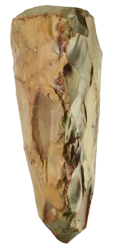

**The Path of Many Arrows**\
**An Odyssey Past Stillness and Singularity**

*(Reimagining Civilization in the Age of AI)*

**Carbon, Silicon**

**&**

**Sam Seatt**

*"We cannot solve our problems with the same thinking we used when we created them."*\
--- Albert Einstein

*Published 2026*\
*First Edition*

Guten Ink
