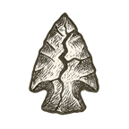

INTRODUCTION

The Arrow You Hold

About two and a half thousand years ago, Zeno of Elea noticed something irritating about arrows. At any single instant, an arrow in flight occupies a space exactly its own length, and in that instant it isn't moving. String the instants together and, by Zeno's logic, you get an arrow that never moves at all. It took a couple of millennia (and the invention of calculus) to explain properly why the arrow arrives anyway.

I find the paradox way more useful than its solution. Civilization often behaves like Zeno's arrow: ambitiously in flight, and in those instants where it matters most, we find it standing perfectly still. We went from campfires to data centers, from inherited myths to borrowed algorithms (the myths remained blissfully unaffected by the upgrades), and along the way we built tools that now move faster than our judgment about how to use them.

This book follows that arrow from the moment it left the bow, asks why so much of it still hangs in the air, and wonders whether we can do anything about its aim before our systems, human and machine alike, outrun us.

**Why this book exists**

I wrote it because I don't believe the questions in front of us now (about AI, the economy, justice, knowledge, care and meaning) will be answered by technology alone. Nostalgia won't answer them either, nor ideology, nor the administrative rituals of a civilization that has a habit of mistaking procedure for wisdom.

Answering them means looking backward and downward first: at the castles we built, the monsters we met inside them, the stories that organized us, the systems that scaled us, and the cracks that stayed hidden until the walls started to go. It also means looking forward with more discipline than hope can supply on its own. If we are heading toward anything worth calling a singularity, I would like it to be a humane one, where intelligence serves life instead of devouring it, and where our systems learn to sense, adapt and steward rather than simply optimize and consume.

Physicists have had an "arrow of time" since Arthur Eddington named it in the late 1920s. I'm borrowing their arrow and splitting it in two. The **thick arrow** is the long civilizational arc, from cosmos to code. The **thin arrow** is my own life, with its wonder, confusion, failures, work and caregiving. I don't offer the thin arrow because it is special; I offer it because it is the one I can vouch for. The book is about what happens when the two collide, and whether the structures on the thick side can still be redesigned.

It isn't a textbook, and I have tried hard to keep it from becoming a manifesto (a real occupational hazard for someone who has worked as a consultant). Think of it as a woven map: memory, science, critique and some possibilities, laid over one another.

**How this book is woven**

There are three volumes. They run in sequence, but they also reach back into one another, so that the later ones reinterpret the earlier.

**Volume I --- Φ: The First Archers**

Volume I is the ascent. It traces the emergence of the physical universe, then life, mind, society, and the systems that scaffold civilization: industry, economics, politics, ideology, ecology, and finally information and synthetic intelligence. Personal recollections run alongside each domain, because those same domains shaped my life as well as civilization's.

It is the volume of wonder, though not the naive kind. Each domain has a **castle** (the system or shelter we built), a **monster** (the failure, cost or threat living inside it) and an **upheaval** (the jolt that shows what the castle couldn't protect). By the end, the reader has traveled from cosmos to code, and from childhood memory to the threshold of machine intelligence.

**Volume II --- Δ: The Still Arrow**

Volume II is the reckoning, and Zeno's volume. If the first asks how the world thickened, the second asks why, for all that motion, so much stays stuck where it matters most. Its chapters are organized by recurring **failure types** rather than by domain: missed signals, runaway dynamics, rigid stories, fractured morals, vanishing commons, still tools and still minds, the ways institutions, models, technologies and people go blind, brittle or captured. It is the darkest volume, but the pessimism has a job to do: it prepares the ground for design.

**Volume III --- Θ: The Basket We Weave**

Volume III is the design horizon. It offers recipes, though not blueprints: evolving sketches for governance, economy, education, healthcare, the commons, justice, memory and the future of intelligence itself. It draws increasingly on my broader Neuro / Neu vision, and on the idea that civilization may be missing a mature layer of collective cognition, a distributed cognitive commons I later call **Neusphere**. It asks what it might feel like to live inside something better, and what would have to be built so that "better" doesn't quietly turn into another cage.

One distinction matters throughout. The scenes set in my past happened as told, as far as memory and records allow, and I haven't dressed them up. The scenes set in the future, mostly in Volume III, are imagined, and they are marked as such.

**The chapters and the interludes**

Between the chapters sit **interludes**, which work as parallel mirrors, and their role changes as the book goes on.

In Volume I they are the **Silicon mirror** to the chapters' Carbon ascent: while the chapters follow our natural and civilizational world into being, the interludes follow the computational one, from semiconductors and data to software, networks, cloud and the AI stack, and show how our tools grew up alongside our institutions before starting to reshape them.

In Volume II they become **instrument panels**, compact looks at the machinery underneath each pathology. A chapter about signal loss gets sensing and the Internet of Things; one about hidden structure gets quantum mechanics and computation; one about caged models gets cryptography, privacy and encapsulation. They usually end up in technology, but they start wider (in science, philosophy or structure) so the reader sees the architecture under the symptom rather than just the "tech side."

In Volume III they become the **builder's mirror**. The chapters ask what it is like to live in a better civilization; the interludes ask what would have to be built, technically and institutionally, for that civilization to exist without collapsing into fraud, capture or spectacle.

The interludes are meant to demystify, not overwhelm: keys rather than encyclopedias, enough literacy to let a reader critique, imagine, and perhaps someday help build. You can read each one beside its chapter, skip them and return later for a second pass through the book's hidden machinery, or dip in wherever your curiosity pulls hardest. They come from the same urge that took me from curious child to engineer, consultant, critic and would-be builder: wanting to know how a circuit becomes a decision, or how a language of bits becomes a marketplace, a border, a hospital or a courtroom.

**Why the personal stories are here**

Throughout the book you'll find stories from my own life: moments of wonder, shame, fear, work, migration, study and caregiving. They are not morality plays, and they are not fictionalized. They are there because big ideas tend to float off unless something keeps them tied to the ground.

So a plane ride becomes a meditation on existence. A school assembly becomes a lesson in blind systems. A broken machine becomes a lesson in humility and alignment. A loved one's illness becomes an X-ray of modern healthcare. A consulting job, a city, a migration and a crisis each open a small local window onto a much larger structure. The point isn't to turn the book into a memoir; it's to keep its abstractions answerable to lived reality (mine, and I hope occasionally yours).

**How to read it**

The book is designed to be read in order, and that is how it works best. But you can also enter it by urgency: Volume I for context and wonder, Volume II for diagnosis, Volume III for recipes. Most chapters open with a small scene, always true and exact when in the past, and imagined under my best judgement of realism when projected into the future as you'll meet them in Volume III.

Bring your own questions. Argue in the margins (I'd be a little disappointed if you didn't), and add your own arrows. This book is my crude look, sometimes with a homemade magnifying glass. It only becomes a book (and you its author) when you chew it down with teeth sharper than mine and envision your own world with intellect superior to mine. Then you write the actual book: sometimes on paper (or screen), sometimes with code, sometimes in systems, inevitably over information, and often through the fabric of our human civilization.

**Open by design**

This is not a closed system, and I hope it stays porous. Its arguments will evolve, and its recipes are not sacred. If it succeeds, it won’t trap you inside my framework; it will help you notice where your own framework starts to shift. The world ahead won’t be saved by obedience to any one author’s architecture (least of all mine). If it’s built well at all, it will be built by many minds learning to sense, deliberate and revise together.

The book is a wager of sorts. There are multiple paths forward. One where we avoid technology or keep it in total subservience to human control. A second is where technology is either designated as the last-standing steward of us, or allowed into a runaway singularity. But intelligence need not end in domination, and technology need not end in enclosure, and a singularity worth surviving has to be woven with dignity, plurality and care.

**Before we begin**

I hope that somewhere along the way you’ll notice your own stories alongside mine. In a room that did not understand you, around an institution that managed you instead of caring for you, and at a place where possibility seemed to disappear and perhaps hasn’t yet.

So let’s begin with a boy on a plane, somewhere between two worlds.