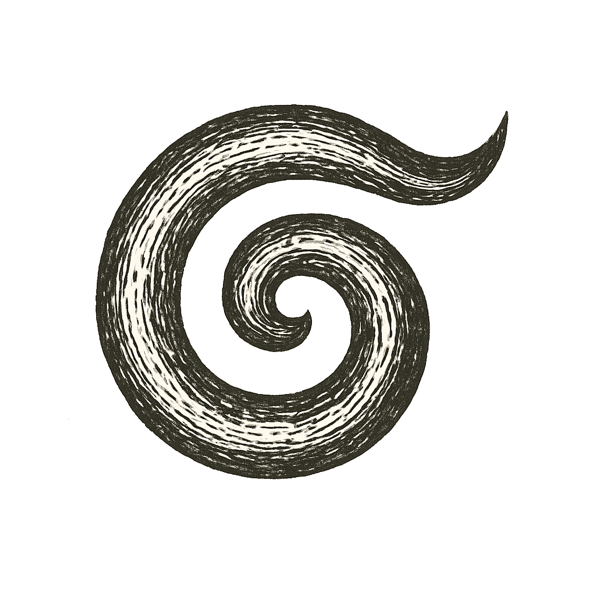

In the beginning, there was no dark, no light --- not even nothing. In the beginning, there was no beginning. A rift tore open in the void, and a roar of fire and time burst forth.

That space swelled faster than thought, stars were forged in chaos, laws carved into the newborn night.

Darkness drew matter into swirling towers; fire raged until it birthed the quiet spark of order.

And yet, beneath the brilliance, silence lingered: no answer to why the void cracked, why there is something rather than nothing.

*What castle can hold the truth of our beginning, if even the stars burn without knowing why?*
