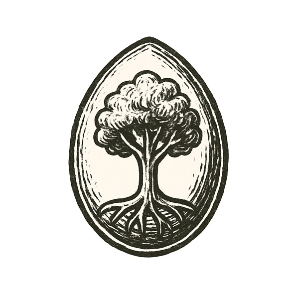

The ocean was black, hot, alive with storms. Lightning split sulfurous clouds, each strike flaring across waves churning with minerals.

In cracks of the seafloor, vents belched superheated water. Greasy films formed on rising bubbles --- fragile membranes trapping molecules that stuck, broke, and stuck again.

Most crumbled, but some held shape just long enough to copy themselves: tiny rings of order defying chaos.

Iron and nickel lattices sparked reactions. Protons and electrons danced across gradients, pushing matter from stasis into restless patterns.

Each second, heat threatened to tear these loops apart. But each second, they tried again.

And in the dark, the monster of entropy watched --- until life took root, trembling but defiant.

---

*But what kind of monster would this life become?*
