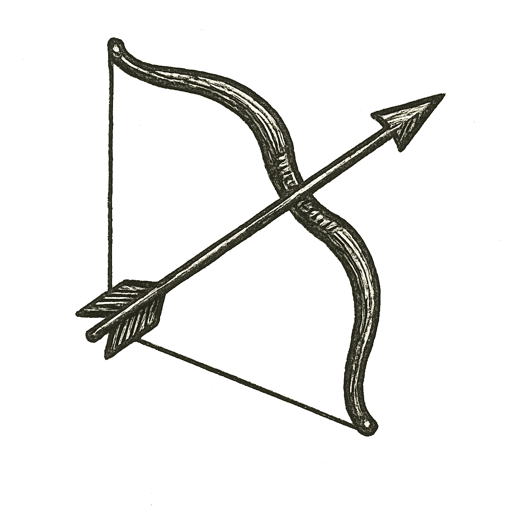

Seats hummed beneath flight suits as engines rumbled to life. A soft shudder became a roar, vibrations climbing up spines and ribs. Hands gripped switches, eyes flicked to glowing displays.

Gravity's pull loosened as the shuttle strained skyward, each second a triumph of steel, fuel, and thought. Through small windows, the world curved away --- oceans spread blue and endless, clouds layered like white continents.

Voices crackled in headsets: checklists read in calm tones, hearts pounding beneath measured words. The cabin glowed with sunlight breaking over the horizon, shimmering across helmets and control panels.

For a moment, wonder eclipsed fear. Humanity was leaving home, carried by minds that had learned to shape fire.

A flicker outside. A lurch.

Then ---

*How far can our reach go before it breaks us?*
