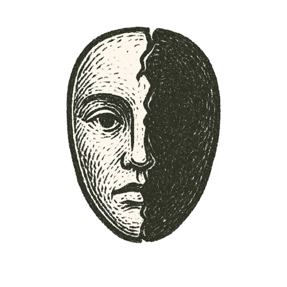

_The heart is deceitful above all things, and desperately wicked: who can know it?_

A hotel room in Milwaukee, in the autumn of 1987. Two men had come in from a bar, and only one of them would leave alive.

The man who woke that morning believed he had won. For nine years he had told himself that the thing inside him was buried, and he had nearly come to believe it.

He woke to bruises on his own hands, and to a stranger beside him who was no longer breathing. He would say he remembered nothing. He would say he could not believe it had happened.

So the question was no longer who had done it. The question was who he was.

He stopped resisting after that, as if the evidence had settled an argument he had been losing for years.

The other man was Steven Tuomi, twenty-five, of Ontonagon, Michigan. His remains were never found.

---

*How fragile is the line between thought and horror?*
