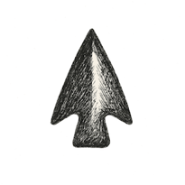

CHAPTER 5

# The Burning City

*Injustice, Rage, and the Monster We Build Together*

*SOCIOLOGY*

> "Those who make peaceful revolution impossible will make violent revolution inevitable." --- **John F. Kennedy**

I must have crossed twenty-four hundred miles, eight state lines, and at least three existential crises before it dawned on me that Los Angeles wasn't a city at all --- it was a mood with zoning laws. Somewhere past Barstow, the air thinned into a blend of smog and ambition. Even my Corolla inhaled it, wheezed, and filed a formal complaint. Billboards got taller. The tan got louder. By the time I hit the Grapevine I half-expected a sign reading:

**ABANDON SANITY, ALL YE WHO ENTER HERE.**\
*(Population: aspirational.)*

USC rose out of all this like an island of red-brick respectability floating in a sea of sun-baked entropy. I arrived expecting to enroll in computer engineering; Los Angeles immediately corrected me. What I had actually signed up for was a minor in anthropology, a certificate in crowd psychology, and a casual elective in urban survival.

I moved into my apartment and discovered that LAPD helicopters are not a metaphor. They are a municipal lullaby. My roommate slept through them the way Victorian infants supposedly slept through cannon fire. Within a week I learned three things:

1.  The sound of distant gunfire travels surprisingly well.

2.  LA fireworks come in two varieties: *celebratory* and *diagnostic.*

3.  Apparently I can sleep through less than my roommate but more than I'd previously advertised.

If Milwaukee had been the beer can and Madison the boil kettle, then Los Angeles was the entire brewery --- pressurized, fermenting, occasionally exploding. Everybody was hustling something: a screenplay, a salvation, or a parking spot. Fraternity Row looked like Darwin had subcontracted to MTV. I spent my first month toggling between awe and confusion, like a misplaced academic auditing MTV Spring Break.

### Cracks in the 'Foundation'

While I was unpacking, James Coleman's *Foundations of Social Theory* hit the bookstores --- an 800-page attempt to explain why humans ever manage to agree on anything. Rational Choice Theory, he called it: the notion that society is basically a spreadsheet, everyone optimizing their personal utility like well-behaved micro-economists.

Back then, I couldn't have identified Coleman in a police lineup --- which incidentally was a non-zero probability event where I lived. But standing amid kegs, palm trees, and moral turbulence, I understood exactly what he meant. LA was running a live seminar in the calculus of incentives. Every person seemed to be a perfectly calibrated shark, measuring angles before the first bite.

And yet Coleman's model missed a crucial variable: **traffic.**

The true social contract of Los Angeles is written not in law books, but on its freeways. Merge or die. Signal and be punished. It's the purest rational-choice laboratory ever constructed by a civilization of well-intentioned pessimists. Eight lanes wide, zero lanes rational.

But beneath that asphalt logic lay something darker: layers of inequality stacked like geologic strata --- glamour atop grief, hope atop resentment. Helicopters circled above us like anxious neurons. Radios crackled with police codes that doubled as civic diagnoses. I would look at the LA skyline and see both the dream and the shadow it cast --- and for nearly two years, I told myself this was progress. That humanity could coexist inside its own contradiction.

Then one night the contradiction caught fire.

And here, finally, is the hinge of this chapter: If Dahmer was a monster born in private, the riot was a monster born in public ---**a creature built from many hands, many grievances, many histories.** A monster we build together, sometimes without meaning to, sometimes because we feel we must.

I didn't know any of that as I rolled into town with my suitcases and Patrick's boombox --- the one he'd asked me to ferry for him like some suburban Christopher Walken delivering a sacred watch across enemy lines. I was just a grad student with too many hopes and too few data points, standing at the edge of a metropolis whose fault lines were already buzzing.

The monster was stirring long before anyone smelled smoke. But I was new, optimistic, and naive enough to mistake the tremors for background noise.

It wouldn't stay background for long.

## **The Rational Contract**

James Coleman had the kind of faith in human rationality that only an academic with tenure and a functioning air conditioner could afford. In *Foundations of Social Theory* (1990), he proposed that society is essentially a giant spreadsheet of incentives --- an economy not of dollars but of decisions. Each person, he argued, acts like a well-behaved calculator: selecting the option that maximizes their personal utility.

Back in Wisconsin, this made perfect sense to me. I had just spent years debugging circuits and optimizing state machines; the idea that society might also obey a form of logic felt comforting, even flattering. Rational Choice Theory seemed like the social-science version of Ohm's law with serial and parallel resistors: apply pressure, get current in some manner. Misbehavior? Probably a bad resistor somewhere.

Los Angeles disabused me of that notion in about four days.

The first time I took the 405 during rush hour, I realized rationality was not the currency of the realm. The freeway was less an optimization problem and more an emotional seismograph. Coleman's homo economicus would not last ten minutes on the 10 East. Drivers weaved, honked, tailgated, and occasionally prayed --- a kind of **emotional calculus** whose variables included anxiety, childhood grievances, and the current price of housing in Culver City.

It was the purest laboratory for rational choice ever devised, except the results were consistently irrational.

Coleman had quantified incentives, but he had underestimated the importance of things that do not fit in equations: shame, pride, belonging, resentment, envy, status, fear, the desire to look important when changing lanes, and the reflexive urge to punish anyone who signals *too* early. The city ran not on logic but on **Wertrationalität** --- Weber's value-rational action: the things we do not because they are efficient, but because they *mean* something to us.

That was Los Angeles in a nutshell: a metropolis where meaning trumped logic, and identity routinely beat efficiency in a best-of-three.

At USC, this became impossible to ignore. Collaboration in class would mutate into competition by the second assignment. Faculty meetings operated like politely disguised parliaments. Discussions in frat houses spiraled like recursive loops that no debugger could rescue.

Even the coffee line had a governance structure. Each queue was a trust exercise: you surrendered a bit of personal freedom in exchange for caffeine, thereby reenacting civilization in miniature.

Coleman tried to model all that with equations. Weber tried with prose. LA resisted both. It was a city where incentives clashed with identities, where rational actors negotiated with irrational histories. Where the past --- redlining, segregation, policing disparities, economic fault lines --- lived just under the asphalt, whispering into the present.

And I began to notice something unsettling: **the system itself behaved like a neural network that had been overtrained on trauma.** Inputs did not map cleanly to outputs. Patterns repeated whether useful or not. The city would "activate" in unpredictable ways --- a tension here, a spark there --- and no one could quite explain why.

Even my own motives were part of this web. Why was I here? To learn? To belong? To reinvent myself? To find purpose? Or simply because Patrick needed someone to drive his boombox across the Mojave Desert?

The more I observed, the more LA looked like a society trying to make sense of itself in real time --- one operating system running on too many unpatched drivers. Systems theorists would call it **nonlinear dynamics**. Sociologists would call it **collective behavior**. The rest of us would call it **Tuesday**.

For nearly two years, I told myself that this chaotic equilibrium was sustainable. That a city founded on contradictions could balance them indefinitely. That the system's feedback loops would hold.

I believed that --- right up until the moment the feedback loops failed.

But that part comes later. Upheavals, like monsters, deserve their own entrance.

## The Architecture of Order (and Other Illusions)

Every civilization, I eventually realized, is a magician with good drywall.\
The trick is always the same: hide the wiring, sell the view.

In Milwaukee, the pipes were honest. You could see the steam lines sweating in winter, hear the radiators hiss like tired snakes. In Los Angeles, the infrastructure was emotional. The plumbing ran through zoning codes, credit scores, and memories of who had once been welcome where. Freeways were not just concrete; they were frozen arguments about whose time and safety mattered.

Coleman gave me equations for cooperation. The city gave me something messier: asymmetry. Wealth pooled here, risk pooled there. Some neighborhoods had sidewalks and shade; others had liquor stores and bulletproof glass. Sociologists had precise names for this---structural inequality, institutional racism, systemic bias. My engineer brain translated them into something simpler and less polite: design flaws.

From above, LA looked like a circuit board. From below, it felt like a machine that worked beautifully for a small set of users and treated everyone else as heat loss. Bus routes mapped old redlining scars. School districts traced property values more faithfully than they traced children's potential. The same exit ramp could deliver you to Beverly Hills or to a neighborhood that only appeared on the news when something burned.

None of this required a grand conspiracy. That's the unnerving part. Like algorithms, systems don't need malice; they just need optimization targets. Give a city the wrong objective function---maximize property values, minimize "disorder," keep certain people "over there"---and it will quietly recompile itself into a hierarchy no one admits to designing.

The sociologists I later read---Durkheim, Parsons, Goffman---offered different vantage points on this same machine. Durkheim talked about solidarity and anomie, about the ways we knit meaning together and then slowly pull the threads. Parsons dreamed of equilibrium and functional systems; Los Angeles responded with earthquakes. Goffman described life as theater; LA answered with casting calls and security cameras.

What I felt walking those streets was not equilibrium so much as pressure. Everyone seemed to be running hot: the cashier behind the Plexiglas, the cop in the cruiser, the professor in the faculty meeting, the student calculating rent on a teaching assistant's salary. The whole metropolis felt like a boiler room that had been rebranded as "open-plan living."

We called it growth, because "increasingly unstable high-energy configuration" doesn't fit on a Chamber of Commerce brochure.

This chapter is my attempt to pull the drywall back. To treat social order the way we treated circuits in earlier chapters: sketch the diagram, trace the current, see where the load ends up, and ask the awkward question we avoided in psychology: **What if the monster isn't just inside people, but inside the systems we've built together?**

Consider what follows an introduction to the anatomy of social systems---how injustice becomes infrastructure, and how the wiring hums long before anything catches fire.

## From Mind to Mob --- Sociology Emerges

Once you've watched Dahmer on the evening news and a city flirt with combustion, you eventually realize that psychology alone is too small a lens. The question stops being, *"Why did this person do that?"* and becomes, *"How did we end up building a world where this keeps happening at scale?"*

That pivot--- from neuron to norm, from impulse to institution---is where sociology walks in.

If psychology gives us the inner weather report ("60% chance of rumination, with scattered intrusive thoughts later in the day"), sociology gives us the climate. It asks why, across millions of people, certain storms keep forming over the same neighborhoods.

The Greeks saw the outline. Aristotle called us *zoon politikon*---the political animal---implying that a human alone is not quite finished, like a device waiting for Wi-Fi. But it wasn't until the soot and crowding of the Industrial Revolution that the modern discipline of sociology really took shape. When you pack humans into tenements, clamp them to factory schedules, and run train tracks through their villages, new questions arise: Why does this feel wrong? Who built this? And why do they never ride the night shift?

Auguste Comte tried to answer by treating society as an organism---messy, yes, but law-governed. He dreamed of a "social physics," where human behavior could be plotted and predicted like planets. Durkheim then gave that dream a spine. He talked about **social facts**---marriage, funerals, laws, Tuesday staff meetings---things that exist outside any one of us yet press on each of us like atmospheric pressure. You don't invent them; you merely inherit the dress code.

Max Weber, meanwhile, looked at the growing forests of paperwork and saw something darker: rationalization turned into a cage. Bureaucracies, he warned, were not just efficient; they were soul-shaping. You organize a world around clock time, credentials, and standardized forms, and soon enough people start to think of themselves as items on a checklist.

And then Marx barged in like the relative who has no patience for small talk and immediately asks who owns the house. For him, history was not primarily about rituals or meaning; it was about **production and power**. Who controls the factory? Who owns the land? Who writes the laws that decide whose suffering is "necessary" and whose anger is "unacceptable"?

Between them, these early sociologists sketched a sobering picture: we do not float in personal freedom so much as swim in currents we did not design. Psychology can tell you why you hesitate; sociology tells you why the choice in front of you is between two bad options.

This chapter is the moment our narrative crosses that disciplinary border. In Part I so far, we've moved from particles to cells to minds. Now we let those minds sit together long enough to form tribes, institutions, riots, and revolutions---and we ask what kinds of monsters emerge **between** people, not just within them.

If psychology is the study of what happens when the brain talks to itself, sociology is what happens when brains start talking to each other and can no longer agree on who started it.

## Hierarchies, Tribes, and Tokens --- The Primal Blueprint

Before there were city councils and corporate org charts, there were primates arguing with their shoulders.

Watch a troop of baboons or chimpanzees long enough and you'll see familiar politics: dominance displays, strategic grooming, consolation hugs, side-eye. Frans de Waal has spent a career making humans uncomfortable by pointing out how much of our boardroom etiquette was beta-tested in the trees.

Hierarchies in these species aren't purely vicious. They reduce constant fighting, coordinate group defense, and organize access to resources. Dominance, in evolutionary terms, is a compression algorithm: it turns thousands of possible conflicts into a few predictable ones.

But evolution is indifferent to justice. A hierarchy that keeps the group alive can be brutally unfair to individuals. Low-ranking animals live with more stress, more disease, shorter lives. The system survives by burning through certain bodies faster.

Humans took this template and added something astonishing and slightly dangerous: **symbolic thought**. We didn't stop posturing; we just learned to outsource the posture to tokens.

Instead of a single alpha standing on a rock, we got crowns, uniforms, letterheads, badges, job titles, follower counts. Tokens let status travel. You don't need to see the chief if you can see the flag. You don't need the landlord in the room if the deed is in the drawer.

This is where "social constructs" enter---not as magic words that make material reality disappear, but as shared fictions that become real by collective enforcement. Money is a construct; so is race; so is law; so, often, is "merit." They're not imaginary in their effects; they're imaginary in their origins.

Tokens allow us to scale the tribe from fifty apes around a water hole to fifty million strangers under a flag. They also let us launder violence through procedure. A baboon shows teeth; a modern bureaucracy sends a letter with a 30-day notice.

The monsters we build together rarely look like beasts. More often they look like systems that nobody "meant" to be cruel, yet somehow always lean on the same necks.

### The Primate Within

You can take the hominin out of the savanna, but you cannot, it seems, take the savanna out of the hominin.

Robert Sapolsky, in *Behave*, describes us as primates with prefrontal add-ons: baboon hardware with an overclocked cortex bolted on top. The upgrade allows for ethics, spreadsheets, and PowerPoint, but the old firmware still boots.

Consider ingroup bias. You can divide people into "Team Blue" and "Team Green" with nothing at stake except a colored sticker, and within minutes they'll start favoring their own group in tiny but measurable ways---more trust, more generosity, more benefit of the doubt. No history, no grievance, just labels.

Scale that up to ethnicity, religion, class, or party, and the stakes rise fast. Old tribal instincts begin to wear modern costumes:

-   Xenophobia and racism as misfired group-defense circuits.

-   Corporate loyalty and sports fanaticism as respectable tribal obsessions.

-   Online "communities" as digital clans, complete with shibboleths, heretics, and exile.

The result is not only cohesion but **structural violence**---harm that is slow, normalized, and baked into routines. No one has to wake up in the morning and decide, "Today I'll uphold inequality." It's enough that we follow the script.

When you look at a city with this in mind, you see familiar primate dramas, just with better wardrobe. Alpha males and females in corner offices, coalition-building in committee meetings, grooming rituals disguised as networking events. The amygdala is never far away; it has just learned to use email.

## Scaling the Tribe --- From 50 to 50 Million

Anthropologist Robin Dunbar famously suggested that there's a rough cognitive ceiling---around 150 people---for how many relationships a human brain can track with nuanced understanding. Above that, we start needing help: name tags, job titles, spreadsheets, address books, and eventually, national anthems.

Modern civilization is, in this sense, a giant social exoskeleton. We have extended the tribe by building supporting structures:

-   Identity registries: birth certificates, passports, usernames, Social Insurance numbers.

-   Affiliation signals: flags, jerseys, logos, profile bios, pronouns.

-   Enforcement mechanisms: laws, HR policies, block buttons, content moderation.

These tools are miracles of coordination. They allow you to drink water that strangers purified, trust food you didn't grow, and travel safely through cities where no one knows your name but everyone more or less agrees to stop at red lights.

But every prosthetic comes with failure modes. When the trust scaffolding cracks---when a currency hyperinflates, an institution loses legitimacy, or a platform suddenly changes its rules---the tribe doesn't shrink back to 150; it panics at scale. Supply chains wobble, rumors spread, and suddenly millions of people discover that the shared fiction they were standing on has version-controlled itself into something they no longer recognize.

In computer terms, we've built a massively distributed social system running on unreliable nodes with no global consensus algorithm. And yet, most days, it more or less works. Until, of course, it doesn't.

## Policing the Sacred --- Norms, Shame, and the Machinery of Control

Every society has a list of things you "just don't do," even if no law mentions them. You don't cut in line at the bakery. You don't cheer at a funeral. You don't show up to a job interview in a swimsuit, unless you are auditioning for a very specific line of work.

These unwritten expectations are **norms**---the soft code that runs in our heads and keeps us from turning every social interaction into a negotiation from first principles. They save us time, prevent constant violence, and let us live in relative peace with roommates, coworkers, and in-laws.

Norms also draw lines. They mark insiders and outsiders, "people like us" and "people who should really know better." Break them, and you encounter one of the most powerful enforcement tools evolution ever invented: **shame**.

Shame is the feeling of being seen and found wanting. Neuroscientists can point to regions lighting up on scans; most of us can point to moments in adolescence. It's not just "I did something bad" (that's guilt); it's "I am bad, at least in the eyes that matter to me."

The genius---and cruelty---of shame is that it travels inside the skull. You don't need a police officer on every corner if you can train people to flinch at the thought of disapproval. Families, schools, religions, and media all run sophisticated shame economies, sometimes in the name of virtue, sometimes in the name of compliance.

On top of this, we build machinery:\
Graduation ceremonies to signal acceptance. Mugshots to signal expulsion. Dress codes, etiquette manuals, comment policies, ratings, and reviews. Foucault's panopticon---power that works because you *might* be watched, even when no one is looking---has happily migrated from prisons to office keycards, security cameras, and "last seen online" timestamps.

And then we connected everything to the internet.

Social media turned norm enforcement into a spectator sport. A misjudged tweet can trigger a global ritual of shaming in hours. Surveillance capitalism and surveillance states differ in motivation but not in method: both rely on the assumption that being watched changes behavior.

Most days, the system holds. People keep roughly to the script. But when enough people conclude that the script itself is rigged---when they decide the watchers are corrupt, the rules unfair, the punishments one-sided---something flips.

Shame turns outward. What was unthinkable yesterday becomes, under the right spark, a righteous act today. A smashed window, a burning police car, a toppled statue---these become counter-rituals, acts meant to proclaim: *We reject your definitions of "order" and "respect."*

That is the psychology of a riot: a sudden reboot of what counts as sacred.

## Identity and the Social Self --- Roles, Masks, and the Multiplex Human

Walk into a room and watch your face change. The muscles know before you do whether this is a job interview, a birthday party, or a family argument that has been aging in the cellar for three generations.

Erving Goffman was right to see life as theater. We all have:

-   A **front stage**, where we manage impressions and speak in complete sentences.

-   A **backstage**, where we remove shoes, filters, and certain adjectives.

-   An **audience**, whose anticipated reactions quietly edit our behavior.

The "self" in this view is not a single glowing core but a repertoire of performances. Role theory pushes the idea further: you are, in practice, a bundle of roles---parent, manager, citizen, immigrant, patient, friend---each with its own script and pressure points. Role conflict is what happens when the scripts disagree.

Sociologist Henri Tajfel added another layer with **social identity theory**. We don't just play roles; we join teams. Some are obvious (nation, religion, party); others are subtler (profession, fandom, aesthetic, meme). Each team offers belonging and pride, and each nudges us toward distinguishing ourselves from out-groups. When personal identity feels shaky, group identity tightens its grip.

To make sense of all this, we tell stories. Psychologist Dan McAdams calls it **narrative identity**: the inner myth we formulate about who we are, what we've survived, and where we're going. Culture provides available plots---hero's journey, redemption arc, noble skeptic, misunderstood genius---and we retrofit our lives to something that roughly fits.

In the digital age, this multiplication becomes extreme. There's LinkedIn you, trying to look competent; Instagram you, trying to look interesting; group-chat you, trying to be funny; and search-history you, who we pray no one ever meets. The front stage never fully closes; the backstage is permanently at risk of screenshots.

The costs are real: identity fatigue, impostor syndrome, moral flexibility as we slide between contexts. But there's liberation too. People who could never safely "be themselves" in their immediate surroundings can find a different stage, a different audience, a different tribe. Some forms of resistance---whistleblowing, dissidence, artistic subversion---depend on having more than one self in play.

You could say that sociology is the study of how those masks and stories interact to keep us barely coordinated and perpetually confused.

## Tribal Faultlines --- Prejudice, Groupthink, and the Madness of Crowds

If identity is how we costume ourselves, tribalism is what happens when the costumes start throwing punches.

Our brains, ever thrifty, love categories. They carve the world into buckets: safe/dangerous, us/them, smart/foolish, "people like me"/"people ruining everything." This is useful on a savanna full of predators; it is more hazardous on a planet full of nuclear weapons and comment sections.

Minimal group experiments show how little it takes to light the fuse. Flip a coin, assign "Team Circle" and "Team Triangle," and you'll see favoritism and bias start to creep in. The moral here is not that humans are uniquely awful; it's that our social perception is exquisitely tuned and easily hijacked.

Inside the tribe, another phenomenon joins the party: **groupthink**. Irving Janis coined the term for situations where the desire for harmony overshadows the need for accuracy. Symptoms include self-censorship ("Maybe I won't mention that obvious flaw"), illusions of invulnerability ("We're too smart to fail"), and the slow numbing of conscience.

Enron had groupthink. So did the Challenger decision process. So do plenty of online communities that begin with noble intentions and end with dogmatism. The chilling part is that most individuals inside such systems are not uniquely evil; they are just slightly scared, slightly tired, and slightly dependent on each other.

Put enough of this together and you get crowds that behave like new organisms. Gustave Le Bon's 19th-century musings about crowds surrendering individuality were overgeneralized, but he wasn't entirely wrong: anonymity and emotional synchronization can lower inhibitions. Deindividuation---being "one of many" in a sea of faces or avatars---makes it easier to do what you'd never do alone.

The 21st century added a new amplifier: algorithms optimized for engagement. Our most influential media systems quietly discovered that outrage is more clickable than nuance. Posts that confirm tribal narratives spread; posts that challenge them languish. Falsehoods that flatter a group's sense of persecution can outperform truths that complicate the story.

What you get, if you're not careful, is a global nervous system that is exquisitely tuned to detect threats and almost allergic to self-doubt. Tribal cognition, once a local survival tool, becomes a planetary liability.

## Social Order and Its Discontents --- Structures, Resistance, and Evolution

If crowds are how we unravel, institutions are how we pretend to stay stitched.

Institutions are the slow machines: courts, schools, police departments, churches, unions, corporations, universities. They offer coordination at scale, continuity beyond any one person's lifespan, and enough predictability that you can plan a life longer than a harvest season. Max Weber saw bureaucracy as the rational culmination of this impulse: rules instead of whims, files instead of feuds.

But every scaffold casts a shadow. The same structures that protect can also suffocate. Institutions crystallize power; they decide whose pain is noise and whose discomfort is a policy priority. Borders are lines on maps until men with guns and pens insist otherwise. Laws are ideas until prisons and paychecks enforce them.

From the inside, many people experience social order not as a shared achievement but as a one-sided contract. They are told they live in a meritocracy while watching connections and capital matter more than merit. They are told to trust the law while being stopped, searched, or sentenced differently than their neighbors. They are told to be patient while their lives burn at a faster rate than committee timelines.

When enough people feel excluded, invisible, or criminalized simply for existing where and how they do, pressure builds. Sociologist Charles Tilly talked about **repertoires of contention**---the standard toolkits of protest each era invents: pamphlets, marches, strikes, sit-ins, hashtags, blockades, riots. These are the ways people say, "Your system is not neutral; it is killing us."

Durkheim, ever the optimist, hoped societies could evolve their moral "collective conscience" through such crises, painfully but constructively. Foucault, glancing at prisons and asylums, was less sanguine: he saw institutions as engines for defining and enforcing what counts as normal, sane, legal, or true. For him, resistance was not just about policy; it was about reality itself.

History suggests both were partly right. Some revolutions widen the circle of dignity; others simply swap one elite for another. Today's heretic is tomorrow's hero is the day-after-tomorrow's statue, waiting for its own reckoning.

That's the paradox of progress:

-   Every right we now treat as obvious was once someone's disruption.

-   Every system we treat as permanent was once a messy experiment.

-   Every order we cherish is balanced on the willingness of some people to obey rules and others to challenge them.

We do not build social order once and file the blueprints. We debug it, over and over, while it's running in production.

In Los Angeles, during those years when I thought I was just there for a degree and some sunshine, all of these forces---hierarchies, norms, identities, institutions, grievances---were humming in the background. Sociology would call it latent tension. An engineer might call it a system close to critical load.

I called it "normal life" right up until the week the city decided to demonstrate what happens when the monster we build together finally steps into the street.

## Augmented Crowds --- Networks, Algorithms, and the New Social Physics

For most of human history, sociology could assume a simple architecture: brains in bodies, bodies in groups, groups in places. Villages, markets, armies, parliaments---different costumes, same basic ontology. Humans plus tools, but the tools didn't count as participants.

We did, to be fair, make one early exception: dogs. Long before we wired ourselves into the internet, we wired wolves into us. Over a few dozen millennia, they became something uncanny---neither livestock nor wildlife, but interspecies citizens. We read their body language; they read our moods. We enforce norms on them ("no biting the neighbors"); they enforce norms on us (walk me, feed me, don't shout like that). If you squint, the human--dog relationship is our first large-scale experiment in xeno-sociology: a social contract with a non-human agent that lives in our homes, shapes our routines, and tugs on our moral intuitions. The coming world of algorithms and AI companions will be weirder, but not entirely new; we've already been practicing how to share a society with something that is smart, emotional, and definitively not us.

That old architecture has quietly expired.

We now live inside augmented crowds: networks where humans interact through and with non-human actors---platforms, algorithms, bots, sensors, recommendation engines, filters, feeds. The social is no longer just between people; it's braided with code.

If Chapter 4 was about the brain as a prediction machine, and this chapter has been about societies as pattern machines, then this is where a third machine enters the room: the infrastructure itself.

Consider a typical online "community":

-   Posts are written by humans, but whether you see them is decided by ranking algorithms.

-   Some replies are genuine; some are bots; some are humans paid to steer the conversation.

-   What trends is not what's true or important, but what drives engagement.

-   Moderation is done partly by people, partly by machine filters, partly by opaque policy.

From the inside, it still feels like "a bunch of people talking." But the **topology** of those conversations---the clustering, the cascades, the sudden storms---is being shaped by systems that are not just passive channels. They're more like **active weather**.

Classical sociologists didn't have to deal with this. Durkheim didn't have to ask what happens when the collective conscience is A/B tested. Weber never had to debug a bureaucracy whose rules were being updated by machine-learning models retrained every six hours. Marx didn't see surplus value extracted from attention metrics.

Today, if you ignore that layer, your sociology is incomplete. You get the right questions and the wrong model.

Platforms are not neutral meeting grounds; they're **partial participants** in every interaction:

-   A recommendation algorithm that over-amplifies outrage is not just "showing us who we really are." It is *co-producing* who we become.

-   A hiring system that learns from historical data and faithfully reproduces bias is not just reflecting inequality; it is operationalizing it.

-   A social network that rewards performative virtue and theatrical rage doesn't just host tribes; it cultivates them.

This is why thinking in terms of **distributed systems** is useful. We have millions of human nodes talking to each other through technical nodes, each with its own failure modes:

-   Latency: rumors outrunning fact-checking, outrage outrunning reflection.

-   Partition: communities sealed off by language, recommendation bubbles, or firewalls.

-   Single points of failure: one company's outage taking down whole layers of social life.

In computer networks, we've learned to design for these constraints: redundancy, graceful degradation, clear protocols. In social networks, we mostly pretend we're still in a village.

If Part II will be about diagnosing systemic failure, and Part III about designing better architectures, this is the layer we'll have to grab by the scruff:

-   Who owns and governs the algorithms that now mediate our collective nervous system?

-   How do we design platforms that widen empathy instead of sorting us into angrier tribes?

-   Can we bring the equivalent of safety engineering and fault tolerance into the way we build publics?

We can no longer afford a sociology that studies only the **human** half of a human--machine duet. The monster we build together now includes code.

And the code, for the most part, was not written by sociologists.

## Sandbox Societies --- Prototypes of Better Crowds

If all this sounds discouraging, it's worth remembering that not every social experiment takes place at national scale with tear gas.

Hidden in plain sight are thousands of **sandbox societies**: small, semi-intentional communities trying to prototype better ways of living together. Some are physical---co-ops, communes, maker spaces, community gardens, worker-owned firms. Some are digital---open-source projects, mutual-aid networks, fan communities, DAOs, guilds in online games.

Most of them are messy. Many quietly fail. A few ossify into the very hierarchies they set out to escape. But taken as a whole, they're the R&D department of civilization.

What makes a sandbox different is not perfection but **explicit design**:

-   Rules are written down and revisable, not inherited as unquestioned tradition.

-   Roles are more fluid; people can test different identities and forms of contribution.

-   Feedback loops are shorter; if something isn't working, you don't have to wait for the next election cycle---just the next meeting.

-   Exit is easier; if the experiment goes sour, you can often leave without renouncing your citizenship or your religion.

From a diagnostic perspective, sandbox societies reveal **failure modes in miniature**:

-   How quickly do cliques form?

-   Who ends up doing the invisible labor?

-   How do conflicts get resolved when there's no formal monopoly on force?

-   Which constraints keep them just and sustainable, and which drive them to burnout or capture?

From a design perspective, they're testbeds:

-   Can we run a governance model that isn't pure majority rule or pure shareholder rule?

-   Can we distribute resources without reproducing familiar patterns of exclusion?

-   Can we build norms that enforce accountability without sliding into punitive shaming?

NEURO, later, will propose more formalized **Edges** and **Meshes** as building blocks of a redesigned civilization---health edges, education edges, governance meshes, and so on. Those are ambitious structures. But their spirit already exists in these small experiments.

You could see sandbox societies as early, rough drafts of what a more intentional, AI-assisted, human-centered system might one day scale up.

They remind us of two things that are easy to forget in a burning city:

1.  Social order is **not** binary---"the system" vs. chaos. There is a whole spectrum of half-systems, micro-systems, parallel systems.

2.  We are not condemned to only inherit structures; we can also **prototype** them.

The question for the rest of this book is not just "What's wrong with the monsters we've built?" but also "Where have we already glimpsed better ones, however small, and how might we nurture them instead of leaving them as curiosities?"

## To Live and Die in L.A.

I was supposed to have left months earlier. I should have finished my master's degree, packed up my car, and joined the great migration north to Silicon Valley, to take my place among the engineers and programmers shaping the technological future. Like my partner in crime, Patrick did -- and later dismissed. That was the plan. That was the advice. But the getaway Corolla was slow to get there this time. The music left without me.

And there I stayed. Held back by a dozen small forces, none heroic enough to defend, yet all persuasive enough to delay departure:

-   **A PhD itch** I wanted to scratch before admitting I wasn't ready to publish anything except grocery lists.

-   **A fear** that once I got a "real job," someone would discover the truth: I was an imposter with decent handwriting.

-   **A sentimental loyalty** to the last years of university life --- that strange tribe where we pretend to be adults by stockpiling cheap beer.

-   **A scheduled commencement ceremony**, which seemed too dignified to skip, given the price of the diploma.

-   **The general gravitational pull of USC**, which was part campus, part social experiment, and part carnival ride.

And perhaps something else --- that invisible hand that seems to choreograph all meaningful upheavals. Had I left when I was *supposed* to, I would have missed what came next. Had I stayed on purpose, I might have called it fate. But I stayed for no noble reason at all, and fate used the opportunity anyway.

During that holding pattern, the city cracked open.

**My Burning City --- On Riot and Recognition**

Some nights stay with you not because you behaved courageously but because the world tilted, and you --- for some reason --- stayed upright.

The night Los Angeles burned, I didn't run.

I lived in a frat house on USC's fraternity row. This one was a faux-Greek temple with white pillars and sun-bleached stucco, a place where, historically, navigating a toga party was the primary survival skill. The real unrest started right outside our immediate vicinity. Everyone else cleared out---went home or moved into the secured dorms like sensible people with survival instincts. But John and I stayed.

Maybe it was bravado? Maybe it was all those fine liquors from Peter's well-stocked bar across the hall? Maybe it was the sense --- inchoate but palpable --- that something historic was happening and we didn't want to miss it. Two things were certainly true. We were two young grad students: one in journalism, the other engineering. Bravery was not in our course catalog, but we had already consumed enough of Peter's liquor to start believing we were social justice reporters and social engineers.

At some point in this philosophical fog, we began chanting, "We want justice!" in that hallway back-and-forth --- not protesting, not rioting, just cheerfully reciting the note Peter had scribbled on his whiteboard before abandoning the premises. In his original context, "justice" meant "please don't drink my Cognacs." We interpreted it as a call for world reform. Spirits (his) created spirits (ours).

What we didn't know was that we weren't alone. The next morning, we learned there had been a third person in the house --- huddled in a room below, convinced our drunken chanting was the arrival of a mob. He hid, breath held tight, waiting for the violence he believed had reached his door.

Three people. One event. Three realities.

-   For us: a surreal night inside a firelit city.

-   For him: terror.

-   For the city: a wound splitting wide.

-   For Peter: unexplained depletion of bar stock.

That is the sociology of riots. They are not a single story, but a collapse of shared meaning. One chant, a thousand interpretations. The world fragments --- and each fragment swears it is the whole.

### **The Riot at My Doorstep --- The Monster Unmasked**

The Rodney King riots weren't headlines to me --- they were geography. I woke the next morning to a city that no longer resembled the one I had driven into. The air carried the smell of blown transformers, fear, and the kind of anger that takes decades to accumulate.

I drove through streets lined with flames, searching for a gas station that hadn't already shut down. I passed stores I knew --- the place I bought my fraternity cap, the restaurant my professor loved --- all swallowed by fire. It wasn't a movie. Movies require extras and permits; this needed neither.

But the true inferno wasn't the one in front of me. It was the one behind it: the fire stoked for generations.

This wasn't chaos; it was consequence. The verdict was only the spark. The monster was much older.

Not a monster born of one man's cruelty --- as in Wisconsin --- but a monster built collectively:

-   Strips of policy layered over decades

-   Policing practices sharpened by fear

-   Neighborhoods redlined into pressure cookers

-   Inequities sedimented like geological strata

-   The quiet resignation of those who benefitted

-   The louder desperation of those who didn't

You can call it injustice. Or systemic failure. Or history demanding attention after being ignored too long.

But whatever name it takes, it is made by *all of us*, one decision at a time.

### From the Child's Basket to the City's Illusion

I thought again of that child on the plane --- in the prologue --- clutching the basket, clinging to the last pattern in a world unraveling.

Los Angeles had its own baskets: The idea that the city was stable, the assumption that injustice could remain contained, and the polite fiction that progress had mended the cracks.

The riots tore through those baskets. What we mistook for "order" was just a thin veneer stretched over unresolved pain.

The city didn't burn because it was broken. It burned because it was functioning as designed.

### **From Sparks to Circuits**

By the time the city's smoke had thinned to a gray haze, my coursework found myself split between the social jungle of Los Angeles, and the systems jungle of Silicon Valley. From Mega-tribe to Nano-tech.

In time, I finally packed the Corolla for the northward drive. But before leaving, I had encountered a different kind of network --- one built not of people but of machines.

But before I did that I met a different kind of network in LA. Cities of their own, made not of people but computers. Before I move, what follows is my wanderings in that city.
