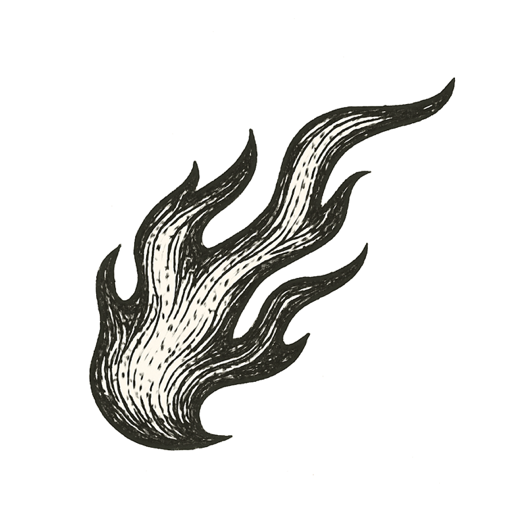

_But let judgment run down as waters, and righteousness as a mighty stream._

A year before, a man on a balcony had filmed police officers beating another man on the ground, and the whole country had watched the tape. That afternoon, a jury watched the same tape and saw something else.

By nightfall the city was burning.

A young man in a small car was looking for gas, the needle sinking. He passed a station with its lights off and its doors open, and people walking out of it with their arms full.

Then the street ahead filled with smoke, lit orange from underneath, and both sides of it were on fire. Behind him there was nowhere better to go.

He held the wheel and drove into it, slowly, because the smoke allowed nothing faster, and the city closed over the car.

He came out the other side. Over the days that followed, more than sixty people did not.

Judgment had been asked to run down like water. That night it came down as fire.

---

*What monster grows when rage sets the city alight?*
