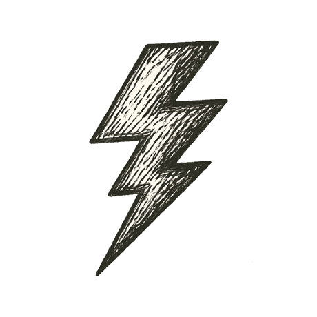

On that lab table, the drive platter spun up just a bit faster. A subtle shift in tone from hum to whine. Just enough to destabilize the servo control loop, sending the read-write head oscillating erratically. A tiny spark arced at the actuator coil. A sudden resonance. A lateral slip. The head collided with the platter surface. Magnetic layers delaminated. Fragments of recording media scattered. The drive ceased all operation.

Below the floor, strain deep in the fault reached its final threshold. Silent cracks spread through rock locked tight for centuries. Stacks of earth shuddered as friction gave way. A sudden, sharp slip sent shockwaves racing upward. The beast pulsed through foundations. Walls creaked. Windows rattled. Chandeliers swung. The city jolted awake.

But "not so fast," whispered Chaos. First, I had to move...

---

*Every step forward breaks something behind.*
