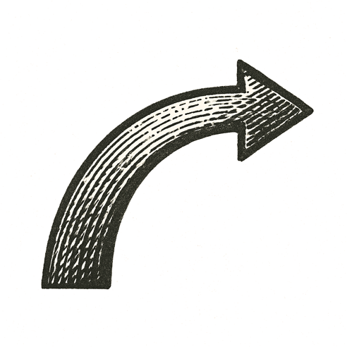

A narrow room buzzed under flickering fluorescent lights. Steel shelves lined the walls, crowded with boxes and rows of paperbacks. Shipping labels curled on cheap tables. The scent of cardboard hung in the air.

A lone figure moved between stacks, scanning barcodes, scribbling notes. Each beep echoed with possibility.

A phone rang once, then fell silent. A computer monitor glowed green text across a black screen, lines of code plotting something bigger than the space could hold.

Somewhere beyond the garage door, midnight traffic whispered through wet streets. Neon signs reflected in puddles. Every passing headlight a reminder of a world unaware of the quiet revolution in motion.

Rain tapped the garage roof in steady rhythms.

*From silence, an empire began to breathe.*
