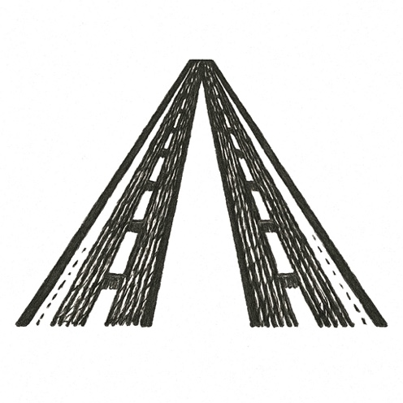

The cabin hummed with morning light. Passengers tucked newspapers into seat pockets, adjusted belts, murmured over coffee in foam cups.

A flight attendant smiled, moving aisle to aisle, eyes scanning for unspoken needs. Overhead bins rattled softly with shifting luggage as the plane banked into clear skies.

Sunlight glittered across aluminum wings, glancing off cloud tops like shards of glass.

Somewhere in the back, a man stared out the window, fingers drumming on his tray table. Another passenger checked his watch, breathing measured and shallow.

Silence thickened. The seatbelt light blinked off. The world, below and above, felt safe.

But a line had already been crossed.

---

*From quiet comfort, history tilted.*
