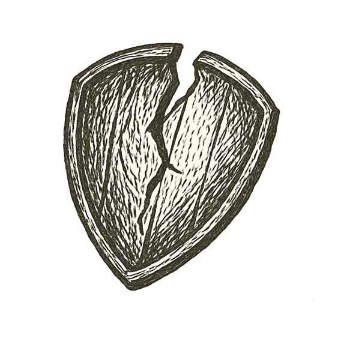

Snow drifted across quiet sidewalks, swirling under streetlights like pale ghosts. Downtown storefronts glowed warm behind frosted glass, shoppers bustling past in winter coats.

A girl's laughter rang out, bright against the hush of December air.

A car crawled through slush, tires crunching ice. Music thumped from its cabin, bass pulsing like a distant heartbeat.

A shout cracked the night, sharp and ragged. Then a pop --- small, metallic, impossibly loud. Footsteps scattered. A scarf fell to the pavement.

Blood bloomed on fresh snow. Silence swallowed the street.

Somewhere above, holiday lights blinked on and off, cold and unfeeling.

*How thin is the ice we build our peace upon?*
