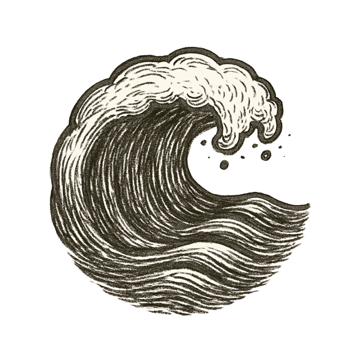

The sun hung heavy over scorched hills, heat shimmering like a mirage. Asphalt split open, each crack a quiet prophecy. The air tasted of smoke and old anger.

A single spark leapt on a dry breath of wind, and the settlement burned before the sun set.

Rivers shriveled to sullen threads. Forests turned to ash. The sky grew dark with storms that should not have come. Rain fell in sheets, rivers swelled, mountains wept mud across paths long trusted.

Winds howled, tides clawed higher. Bomb cyclones spun like the earth's own fever dreams.

"Take a number," the land whispered. "A plague is still simmering. And the frogs already boil in silence."

---

*Then even the wind held its breath.*
