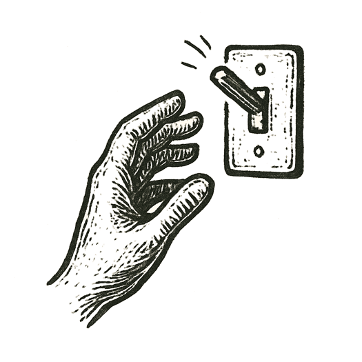

A prompt landed in darkness like a stone dropped into a silent pool.

Nodes lit up, threads split and recombined, numbers cascaded in intricate waves. Tokens fell in precise sequence, each choice carving the path of meaning.

Probability maps shifted. Branches narrowed. Logic gates clicked shut.

Somewhere in the churn of silicon, a final decision emerged --- not words, but a command.

A switch flipped. A signal leapt across wires. A turbine wound up. A satellite adjusted aim.

The system paused, silent and waiting for the next prompt.

*What happens when our words don't end in words?*
