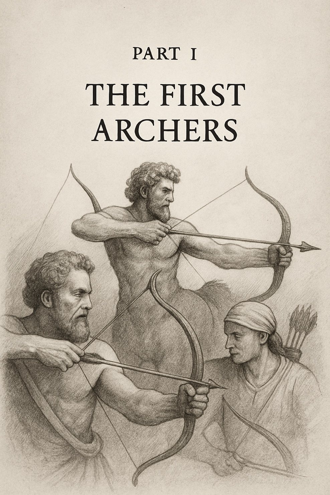

***\
***

***The Monsters We Met,***

***The Castles We Built***

We begin in the haze of creation: the scattering of stars, the chemistry of life, the ignition of minds. This part traces the inheritance we were given and the first aims we took. Here, our castles rise --- physics, biology, consciousness, society, and belief --- each built in earnest, each flawed in its foundation. These chapters explore how our tools of understanding shaped us, how myths calcified into truths, and how ambitions reached farther than wisdom. They are the story of first arrows launched in hope --- and the monsters we found waiting.
