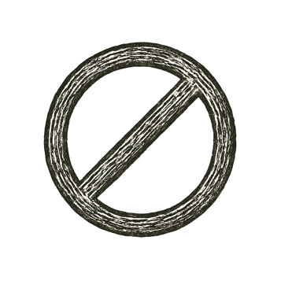

I saw a city built of signs, foursquare and finite, its gates numbered, and over its gate was written: *Here every question shall be answered, and no answer shall contradict another.*

And the builders said, Let the city bear witness to itself. And it was so, for a season.

And a voice asked, Who is worthy to settle every word? And none was found worthy. For out of the city came a sentence, small and well formed, speaking in the city's own tongue, and this was its testimony: *I cannot be proven here.*

To prove it, the city must become a liar. To leave it, the question must stand at the gate forever.

And there was silence in the city about the space of half an hour.

And from that hour there was a truth in the world that would not kneel.

---

*What they built to contain all truth\... could never contain itself.*
