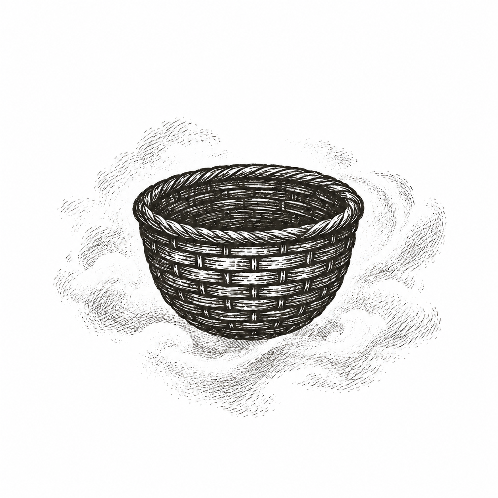

*Wo aber Gefahr ist, wächst / Das Rettende auch.*

*(Yet where danger is, the saving power also grows.)*

> --- Hölderlin, *Patmos*

A loud, groaning plane---likely a Fokker---cut a strange path through the ether.\
The fuselage kept vibrating and shuddering in anger. Its fragile capsule suspended in a vast and invisible sky. Inside, a small boy sat stiff, grinding beneath his own unrest that was no less vast and no less invisible. He was two and a half years old. The world he had known was gone.

Beside him sat a man and a woman, younger than those he had called his parents. They spoke softly. Kindly. They tried to soothe him with words he barely understood. But to him they were strangers---imposters in a world that no longer made sense.

He was not at home. The faces he trusted were nowhere to be seen. The house, the familiar sounds, the persistence that was his small world---all had been torn away. And now he was trapped in this rattling chamber, hurtling through nothingness, with only his fear and confusion as companions.

Only one thing tethered him to what was real: his basket.

It was an otherwise unremarkable thing---woven, rectangular, filled with toys and small treasures. But to the boy it was everything. It was the last piece of the life that had been stolen from him. His ark of covenant. His proof that the world he remembered had not been entirely erased.

He asked for it again and again, his small voice rising above the drone of the engines. Was it still there? Had they taken it too?

The kind man promised it was. He rose, took the boy's hand, and led him down the narrow aisle to the front of the cabin. And there it was---the basket---tucked safely away where he could not see it from his seat, but still there.

Maybe the boy touched it. Maybe he only saw it. Either way, for a moment, the terror eased.

The basket was still there. The world had not been completely lost.

That boy was me.

The kind man and woman---the imposters I feared---were my real parents. They had left me for a year in the care of my grandparents while they crossed an ocean. Now they had returned. Now they were taking me with them. But I did not know that. To me, they were strangers.

This was my experiential Big Bang: the first spark of what would become my conscious self. The innermost Matryoshka doll. A single point of origin resting inside the bubble of a life, itself hanging inside the bubble of a universe. I was a child in suspension: inside a plane suspended in air, on a planet suspended in space, in a galaxy... turtles all the way down.

The plane was not just a plane. It was the first crossing. The first rupture. The first unveiling of the monster that lives in reality itself: the unease of displacement, the terror of not knowing where home has gone, the thinness of the veil that we call the familiar.

---

Thus began my life of crossings. Each move, each departure, would peel back another mask, unearth another monster---hidden in systems, in structures, in the earth beneath our feet, in the stars above, and in the human heart.

And always the question would return: *Is the basket still there?* Is anything I knew still real?

This is the story of those crossings. The monsters unmasked. The basket lost, found, remade---and offered at last to others.
