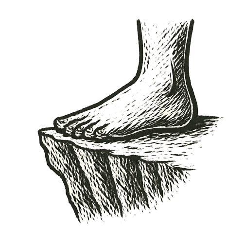

_Never, Gilgamesh, has there been a crossing, and the waters of death lie across the way._  
--- after _The Epic of Gilgamesh_, Tablet X

Tens of thousands of years ago, at the southern end of a narrow sea, a small band of people sat by a fire and looked at the water.

Behind them the land was drying out. Ahead, across a strait the sea had narrowed but not closed, lay another shore, near enough to see on a clear day and far enough to drown in.

Nobody knows how they crossed: on reeds lashed together, perhaps, or driftwood, or something cleverer that the sea has not kept. Perhaps many tried before any arrived.

Much later, people named the strait Bab-el-Mandeb, the Gate of Grief.

Nearly everyone alive outside Africa today descends from people who came through gates like it.

---

*How far must we carry it, just to survive?*
