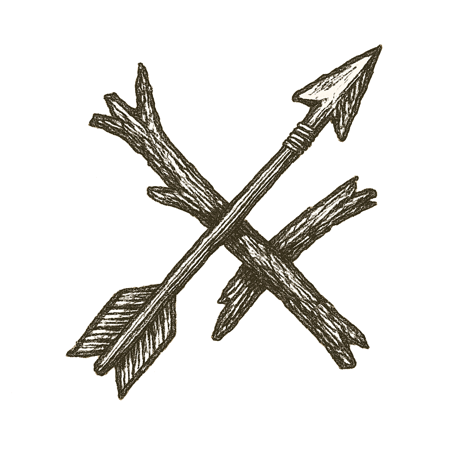

Thunder rolled over the river's banks as dawn burned through fog. A horse pawed the blood-soaked earth, nostrils flaring, eyes black with fury. Bronze glinted on its flanks, its rider's cloak dark with rain.

Men shouted in tongues of Olympus and Macedon, words sharper than their spears. Shields locked in lines, boots sank into sucking mud.

Steel rang. Arrows hissed. The horse lunged, carrying its rider into the storm.

Mud swallowed hooves. Water churned red at the river's edge. Lightning flashed, illuminating a face determined to carve his name across the world.

Behind the charge, a legend took root in foreign soil --- echoing long after helms and crowns lay forgotten.

*How far can glory ride before it curses every road behind it?*
