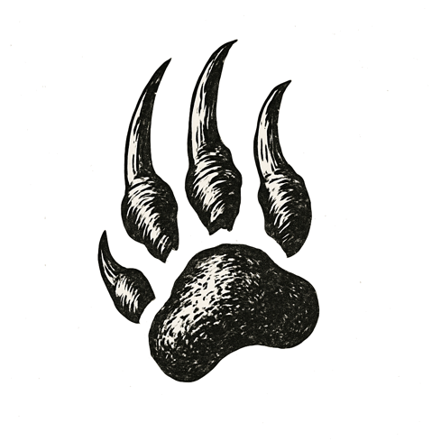

The hall was silent. Hundreds of students stood in rigid rows, eyes fixed forward, breath held.

I stood alone on the stage, lights glaring off polished floors. Below me, a sea of faces watched --- some wide-eyed, others blank, all unmoving.

A finger pointed from the stage's edge, as if the voice of heaven itself had chosen me. My legs carried me up steps I barely felt.

Words thundered above the hush, each syllable cutting sharper than the last. A hand swung. Skin cracked with the sound. Another swing followed, swift and perfect, striking the other cheek.

I stared into the darkness beyond the hall, ears ringing, cheeks burning, the hush louder than any shout.

No one moved. No one dared breathe.

*How blind is a system that strikes before it senses?*
