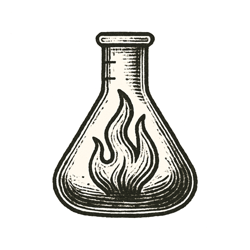

_Ye were not made to live like unto brutes,  
But for pursuit of virtue and of knowledge._  
--- **Dante**, _Inferno_ XXVI

In the spring of 1986, in the middle of a Ukrainian night, the operators of a nuclear power station were running a test of their reactor's safety.

It went wrong slowly, and then all at once. The power fell too low, and to raise it they withdrew more of the rods that hold a reactor back than their own rules allowed. In that kind of reactor, more steam meant more power, and more power meant more steam.

At twenty-three minutes past one, someone pressed the button meant to shut everything down. The rods began to slide back into the core, and for a few seconds their tips made the reaction stronger.

In those seconds, the safeguard became the trigger.

The town beside the station was evacuated a day and a half later. It has been empty ever since.

---

*Monsters breathe invisible fire.*
