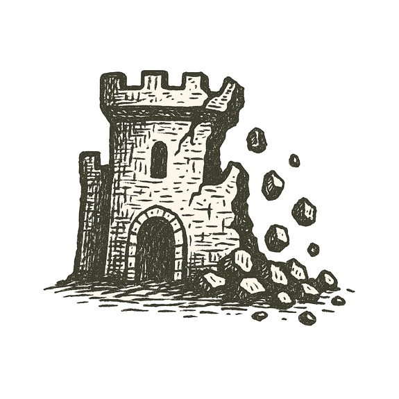

Smoke coiled above marble columns, black against the moonlit sky. Sparks drifted down like falling stars, settling on scrolls stacked higher than a man could reach.

The scent of burning ink filled the corridors. Shadows ran between stone shelves, feet slapping ancient floors as voices shouted in tongues older than empires.

Scrolls cracked in the heat, words dissolving into ash. Generations of thought curled into smoke.

Outside, flames leapt through tall windows. On distant hills, watchers saw the glow rising over the city's walls --- a beacon of knowledge devoured.

The library's heart beat slower with each gust of fire.

---

*When the commons crumble, memory becomes ash.*
