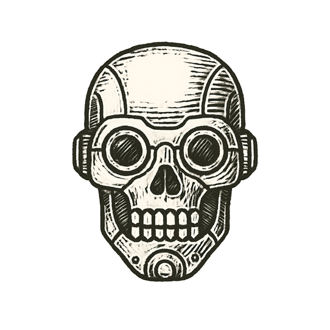

Rain streaked across the windshield, turning headlights into pale, shifting ghosts. The electric hum of the car was steady, each sensor pulsing infrared and lidar into the night.

A bus loomed ahead, sides plastered with an ad of a tunnel stretching into darkness.

Cameras parsed lines and shapes. The neural net hesitated, logic tree branching into doubt.

Tires rolled smoothly, silence inside the cabin absolute. Decision nodes fired: no obstacle detected.

The car drifted forward, calm as the grave.

Metal met metal. Glass burst into crystal rain.

---

*A perfect system, frozen by an imperfect picture.*
