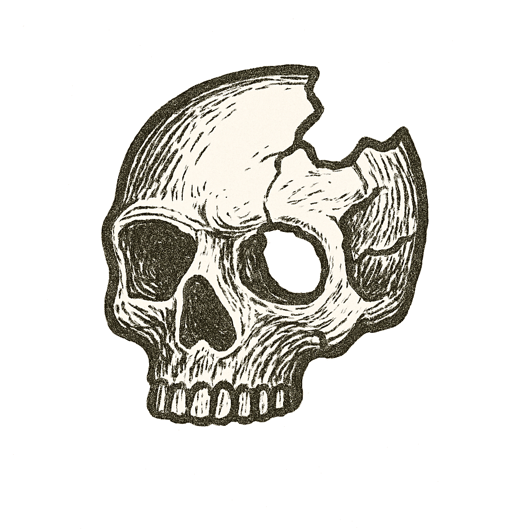

_...the driving of them of necessity gives a great deal of trouble to him._  
--- **Plato**, _Phaedrus_, on the charioteer of the soul

Two years later, at night in Arizona, another car was driving itself. This one had a person in the driver's seat whose job was to watch the road.

A woman was walking a bicycle across a dark stretch of street.

The car's system saw something ahead for more than five seconds, and kept changing its mind about what it was. It had been built to leave emergency braking to the human.

The human was looking down, at a video on a phone, and looked up about a second before the impact. The woman died that night.

The machine had taught the mind that it could rest, and the mind had believed it.

---

*A mind, perfect in intent, stilled by a moment's drift.*
