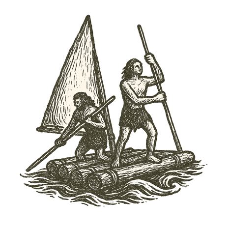

Salt spray hissed against the sides of the raft. Paddles dipped and rose in ragged rhythm. Behind them, the dark line of the old shore shrank beneath a sky paling with dawn.

Eyes searched the far horizon for hints of land --- a dark smudge, a rise of hills, anything beyond the endless sway of waves.

The sea's breath chilled their skin. Hands blistered against rough wood. Children whimpered into mothers' shoulders. Elders stared across the water, minds heavy with stories of beasts they had never seen but feared all the same.

Every creak of the raft carried a question: Would there be fresh water ahead? Would new stars guide them, or leave them lost? Would those they might meet greet them as kin --- or prey?

The old world lay behind, silent. The new world waited, unseen.

---

*They sailed on, hearts split between terror and wonder.*
