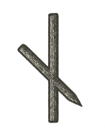

CODA TO VOLUME 2

The Crack and the Claw

> "Need is constricting on the breast;\
> it is a hard companion and a difficult choice\
> and a miserable existence."\
> --- **Anglo-Saxon Rune Poem (Nauðiz)**

Volume I stacked domains like an onion or, if you prefer older engineering diagrams, like turtles all the way down: emergence perched on emergence, each layer resting on the improbable competence of the one beneath it. Carbon and Silicon climbed their parallel ladders, each rung a fresh insult to chaos. It was a tour of how anything coherent manages to arise at all.

If Volume I was an origami of paper-thin turtles, Volume II was the bull in the china shop, only with better manners. It came in close, glowered, scratched off some paint with a horn, and paused to listen for the hollow note. It collapsed the respectful distance that lets us call a china shop a working system simply because nothing has shattered loudly enough yet to startle the right people.

Up close, our familiar structures (psychological, institutional, economic, technical) looked less like achievements to admire from the lobby and more like assemblies overdue for a stress test. And what we found was hard to unsee. The foundations hold more often than fashionable despair likes to admit; it's the load paths that are wrong. The machine still runs, the dashboard still glows, the institution still processes, and yet in the places where trust, fairness, signal and governance should carry the heaviest loads, the cracks are structural, not cosmetic.

The more we stare at these scrappy and fuzzy domains of Volume I, the more Nagel’s View from Nowhere pops up. The inside view is restrictive; the outside view fatal. And the latter can be a problem if the goal is to sustain what we have, without inviting an all-out collapse. That’s the rub. For instance, you cannot run an economy from a pure view from nowhere. If everyone achieved total detached objectivity and stopped “believing” in Harari’s concept of money as a collective “story,” the economy would, in an extreme, theoretical case, begin to collapse. The system often relies on our subjective entrapment. This extends to other stories: flags, religion, norms. Investors, politicians, and priests confront this trouble in their own ways. Is Gordon Gekko’s greed somewhat good, should politicians sometimes lie, and can a priest who has studied physics and biology keep the old stories alive without some duplicity, or only by reinterpreting them?

Some of what we found was dramatic. Much of it was worse: banal. Not harmless, but recurrent, failures that arrived without orchestral accompaniment, as patterns and inertias, ancient grooves waiting patiently under modern terminology. The institution that mistakes throughput for care. The machine that can't explain itself when it is most confident. The civilization that keeps accelerating along its chosen axis and then acts surprised to find the target somewhere else entirely.

That is why the volume opened with a low battery: a small technological stillness paired with a small human one, two systems short on reserve and reverting, under pressure, to whatever the past had trained them to do. The scene was personal, but never private. When coordination thins, signals blur and the pause goes missing, we don't become wiser. We become more ourselves, and "ourselves," too often, means autopilot with a backstory.

Need, as the rune says, constricts on the breast. It squeezes choice until choice looks like fate. It turns governance into triage and reflection into a luxury, and it postpones ethics until after the quarter, after the election, after the flood, after the child has already learned to live with the scar. A civilization can live inside that constriction so long that it starts calling it realism. But need isn't neutral. It is a systems condition, one that can be inherited, manufactured, monetized, or simply neglected into permanence, and much of Volume II has been an anatomy of it.

In Volume I our turtles looked like shields. In Volume II we found the hairline fractures. Some shields were only scratched. Some had been patched so often that the patch had become the structure. Some had been flipped onto their backs (protective in theory, paralyzing in practice, as any upended turtle could tell you). None of them had to break to become dangerous; it was enough that they kept operating under assumptions too old, too thin or too local for the world now moving through them. That is the trouble with overfit systems. They don't fail by going dark. They fail by carrying on with perfect good manners under conditions that no longer deserve their confidence.

The cracks weren't only in the machinery, either. They ran through meaning: the stories we use to excuse inertia, the labels that compress a person into a metric, a case, a user or a nuisance, and the social contracts we pretend still exist because the forms are filed and the logos are still legible. Volume II has not argued that civilization is fake; that would be too easy, and not nearly clever enough. It has argued something more awkward. Civilization is usually real enough to depend on, and nowhere near as well tuned, sensed, governed or maintained as its own paperwork implies.

So this volume has been a diagnosis, not a verdict, and its point was never to sneer (contempt doesn't count as method). It was to name the antipatterns clearly enough that we can no longer call them accidents, and to show that the still arrow is a mechanism rather than a mood: action outrunning reflection, capability outrunning calibration, and systems scaling before they have earned the right to call themselves aligned. That is why the volume's last chapter had to arrive at the pause. Not because history should stop, but because a civilization that cannot pause cannot steer. The rune poet knew it more than a thousand years ago: need can become help and salvation, but only for those who heed it in time.

Diagnosis isn't treatment, though. Naming a monster doesn't kill it, and hearing the hollow note doesn't fill the hollow. If anything, a good diagnosis creates its own vulnerability: once you can see the architecture, you lose the innocence of pretending it is natural, and you are left with the two hardest options people have, repair or complicity. The hardest thing humans ever do is revise the structures that once made them comfortable before those structures make them impossible, and nowhere is that clearer than in our calcified geopolitics, where empires keep mistaking the furious motion of their parts for stability.

As I write this, in early September 2026, the calendar seems to be mocking us. The United States has just celebrated its 250th birthday, a brief and spectacular run as history's premier institutional empire. Across the Gulf sits Iran, the current grumpy caretaker of a Persian civilization with some twenty-five centuries behind it. The two are at war, and the 25th anniversary of September 11 is days away.

Four decades and seven months ago, America and engineering welcomed me with the Challenger explosion, a disaster that came down, in the end, to a ring of rubber too cold to seal, and to managers who overruled the engineers who warned them. In this war, the Strait of Hormuz has stepped into the O-ring's role. We are now engaged in a great naval struggle, testing whether that military machine, or any machine so conceived and so dedicated, can long endure when its fate turns on a single unyielding loop, because men in high offices forgot the unforgiving laws of physics. (This is where the author realizes he is not Abe.)

Empires have their own refrigeration styles. Moscow relies on the meat grinder. Russia's state news agency published its victory essay two days into the invasion of Ukraine, yet the cities it has since taken by assault have cost it soldiers by the tens of thousands, much as St. Petersburg itself was won from the marshes, by many accounts, at the cost of tens of thousands of laborers' lives. Washington prefers the meat locker. Since the war began at the end of February, the plan has been wonderfully simple: blockade Iran's ports, freeze Tehran's economy into submission, and spend billions keeping a passage open through a strait Iran keeps closing. The 2015 nuclear deal was the diplomatic equivalent of investing in mass transit, an attempt to change the network's behavior and route traffic away from the bottleneck altogether. But to a man with a hammer everything looks like a nail, and to a kid with a borrowed baseball bat every oil field looks like a piñata. Our constitutional caretaker walked away from that deal in 2018, and here we are, back in the meat locker.

Boston knows something about meat lockers too. During the Big Dig, engineers froze the waterlogged ground beneath the rail lines near South Station so that tunnel sections could be jacked through it: a temporary, manufactured solid where nature had supplied mud. As engineering it was impressive. As metaphor it is hard to resist, a city making the ground hold still long enough to bury a traffic problem it would never entirely solve [1.1]. Keeping an unworkable reality frozen would take the powers of Elsa from _Frozen_ (a film I confess I have never seen; as I understand it, her sister Anna resolved their crisis structurally, with an act of love). Short of that, holding something frozen against its surroundings costs energy every minute, and the bill only grows.

This is Chapter 12's macrostate problem at the scale of empires. Inside a phase, the particles can jostle as furiously as they like (conscripts thrown into muddy fields, billions of dollars pumped into the Gulf, refrigeration units straining under Boston) without changing the phase itself, and we keep mistaking all that local motion for systemic change. A trillion-dollar military apparatus has been brought to a crawl by a channel about twenty-one nautical miles wide at its narrowest. The lesson has two edges. We should be deeply skeptical of the things we call "Big," projects gargantuan in footprint and bankrupt in macro effect. And we should never dismiss something because it is small. Physics has a word for how phases actually change: nucleation. A supercooled liquid can sit still for a long time and then freeze all at once around a single speck. Real transitions start at small, high-leverage points, and once they start, they can run away faster than any of the old gatekeepers thought possible.

The markets, predictably, did not respond with stoicism. Brent broke a hundred dollars a barrel in the spring, and what has kept it from going much higher is less a strategy than a workaround: a "dark" shuttle trade in which tankers switch off their transponders, hug the coast of Oman, and hand their cargo to ships waiting outside the strait, with US forces escorting some of them through at night. A trillion dollars can buy a remarkably sophisticated flashlight. It still can't light a path through terrain that doesn't work.

The old story was emergence; this one was inspection; the next has to be composition. Volume III is about building, and not the acceleration-fever kind with a cleaner interface and more thoughtful fonts: architecture, recipes, containers that deserve the scale they are given. To find a way there, we will have to look away from the crashing tides of collapsing empires and turn north, toward a different template for the next century.

And we will have to do it while the newest machinery leans in closer. Machine intelligence won't save us by being intelligent. It will scale whatever we embed in it (our incentives, our governance, our categories of care and neglect, our habits of power), and if the structure is cracked, it will make the crack more efficient. At the end of Volume I, the voice in the dark was only making promises.

It has a hand on us now.

---

> Mein Vater, mein Vater, jetzt faßt er mich an!\
> Erlkönig hat mir ein Leids getan! --- **Goethe**, Erlkönig
