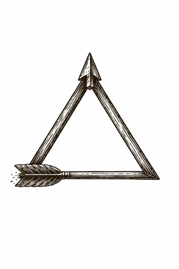

Zeno said the arrow doesn't move.

Not because it can't fly---because when you look closely enough, you only ever catch it *being* somewhere: a point in space, a sliver of time, a still photograph mistaken for a journey.

All of a sudden, a civilization started to suspect the same thing about itself:

We have speed. We have spectacle. We have graphs that climb like prayers. We have castles of invention stacked on castles of invention. And yet, in the places that matter most---meaning, fairness, trust, sanity---the air feels strangely unchanged.

What if our progress is real in motion, but false in meaning?

What if the arrow has been airborne for centuries...

...and still hasn't left the room?

---

*Then the next act isn't aiming. It's diagnosing.*
