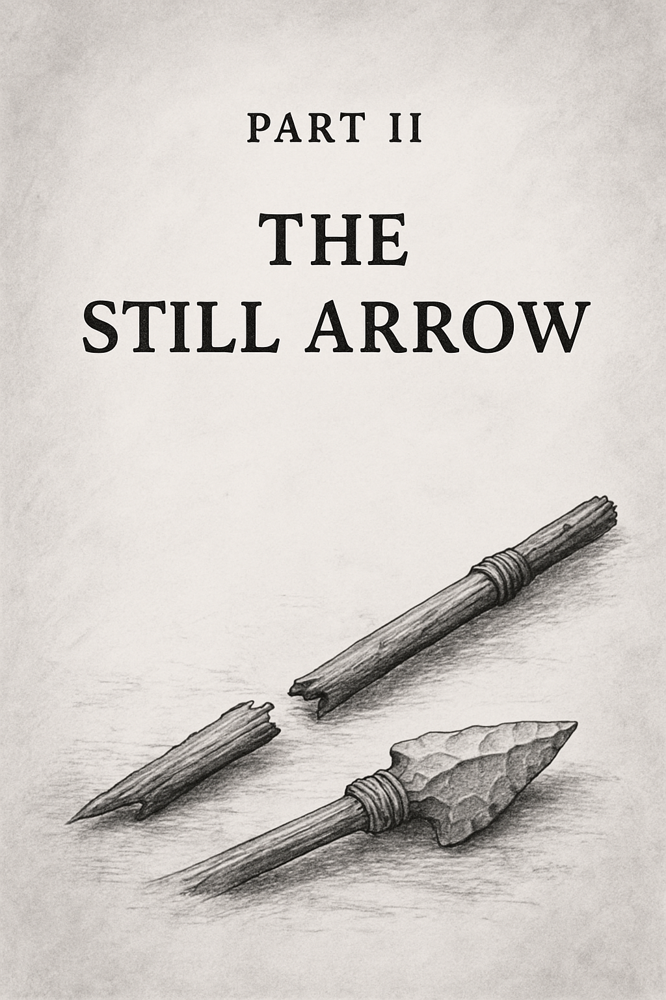

***\
***

***The Cracks That Spread,***

***The Aims That Falter***

In this part, we shift from inheritance to reckoning. The castles of Part I are not gone --- but they lean, fracture, and echo with faults we long ignored. Here, we examine the systems that no longer sense, the myths that trap, the commons that fade. Each chapter dissects a domain of our collective life --- medicine, justice, economy, meaning --- revealing how blindness and stasis turn well-meant aims into arrows that stall mid-flight. Yet in seeing the cracks clearly, we begin the work of deciding what can be reclaimed, what must be remade, and what must be left behind.
