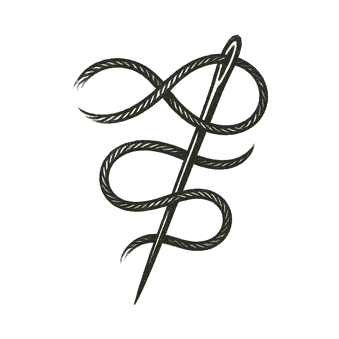

A grandmother sat hunched over a wooden loom, its beams creaking softly in the dawn light. Her fingers moved with practiced patience, guiding threads dyed in earth and midnight tones.

Each strand carried stories: nights spent hungry, mornings survived by chance, dreams that nearly faded. Some threads were frayed, others strong, each representing lives once scattered like leaves in a storm.

She wove them together in careful passes, breath measured, eyes sharp despite their clouded edges. A pattern emerged --- uneven at first, yet more intricate with every row.

Outside her window, the world stirred: birdsong over quiet streets, distant voices arguing and laughing, new monsters and old hopes mingling in the morning air.

She pulled the final thread through, paused, and looked at what she'd made: a tapestry not of cloth alone, but of wounds closed and futures imagined.

*What might we weave if we remember every frayed strand?*
