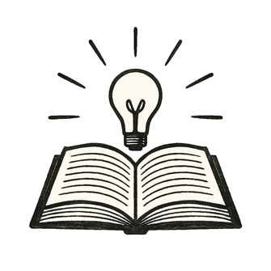

A group of children sprawled across a sunny park meadow, shoes kicked off, knees brushing soft grass. In the center, a circle of small interactive devices projected shimmering prompts into the air.

Today's challenge: *How might we rebuild our neighborhood after a flood?* One child suggested floating gardens. Another remembered how bees returned after their school planted flowers. A third worried about families with nowhere dry to sleep.

Their devices gently prodded them: *What else could you consider? Who might be left out? How did ancient communities face floods?*

They debated with fearless curiosity, each idea stretching their minds wider. Subtle guides within the system highlighted biases, nurtured empathy, and brought old wisdom into new light.

Nearby adults watched quietly --- some parents, some trained educators --- all there to support but never to stifle.

*The world had become their classroom. And wonder, their teacher.*
