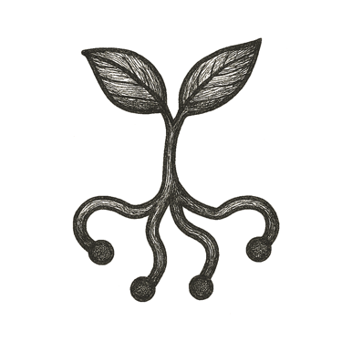

The boy climbed onto a mossy stone, knees damp from morning dew. Sunlight dappled through leaves above, turning the forest canopy into a shifting mosaic of greens and golds.

He pulled a small device from his pocket, tracing its lens over the thick, gnarled bark of an old oak. A shimmer unfolded around him: names of fungi laced through the roots, decades of rainfall etched in annual rings, the tree's carbon captured and the air it still cleaned.

Birdsong paused, as if the forest listened too. He reached out, fingertips brushing the bark, feeling more than wood --- feeling stories: of storms endured, animals sheltered, seeds scattered.

In this forest, nothing stood alone. Every trunk, stream, and stone was part of a living library, a commons held by all and tended by each.

He looked up at the sunlit branches, eyes wide, heart full of a quiet promise.

*This knowledge was his to share, and this place was his to protect.*
