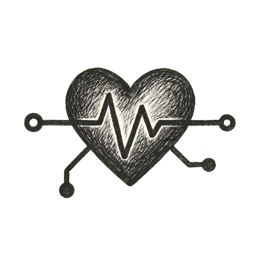

A tram glided to a quiet stop under pale morning skies. The man stepped off, his wristband pulsing a soft green. He didn't rush; his care team had already mapped every step.

As he entered the clinic, the doors parted silently, scent of clean air and warm cedar drifting out. A nurse greeted him by name --- not from a file, but because his wearable and home devices had already streamed a month of vitals, flagged subtle shifts, and tailored his checkup.

Soon he lay inside a softly humming scanner. Gentle lights swept over his chest, generating a personalized imaging plan on the fly: a hybrid echo with targeted views. Beside him, a projection of his digital physician floated just beyond the scanner bore, eyes kind, voice calm.

Each heartbeat traced new patterns across shared displays. Notes and insights wove instantly into his lifelong health record. No rushed paperwork, no cryptic charts --- just a team, human and digital, seeing him fully, caring for him precisely.

*He was never just a chart again.*
