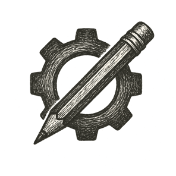

Sunlight streamed through tall windows onto rows of worktables littered with tools, scraps of filament, and scribbled notes. The air smelled of warm plastic and fresh coffee from the communal pot in the corner.

A teen hunched over her tablet, brow furrowed in concentration. On-screen, the contours of a prosthetic limb shifted as she fine-tuned its curve to fit a neighbor's growing child.

Beside her, a 3D printer hummed steadily, nozzle weaving layer upon layer into a gleaming, functional form.

Above her design, a small display pulsed with quiet meaning: a contribution score, not currency or praise, but a living reflection of what she had given --- and what she'd someday receive.

*In this place, creation wasn't competition; it was kindness.*
