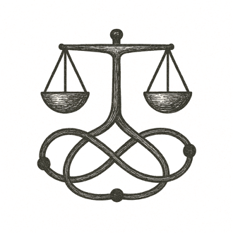

She settled on her favorite bench by the river, sun warming her back as birds sang overhead. Around her, the park pulsed with quiet life --- joggers passing, children laughing.

At her wrist, the woven bracelet chimed softly. A subtle projection unfolded above her hand, showing proposals from her district: a new footbridge plan, floodplain plantings, a community workshop. Each option glowed with potential, balanced by insights beyond any one mind's reach.

She read, thought, and added a comment about planting native grasses to reduce erosion. The words slipped instantly into the shared draft.

She looked out across the water, feeling a quiet certainty: her voice mattered, even here, and every morning offered a chance to shape the world.

---

*The river listened---and so did the world.*
