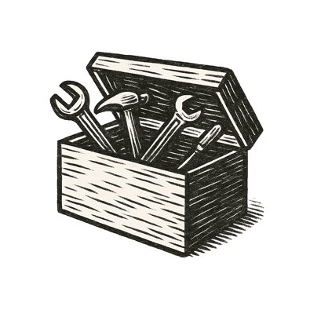

A middle-aged woman sat on a clinic bed, the rustle of exam paper beneath her. On her wrist, a bracelet pulsed softly. A health dashboard bloomed above her palm --- not just risks, but tailored insights into diet, medication, even emotional rhythms.

Another window shimmered into view: her de-identified genome mapped into a lattice of shared data. In labs around the world, researchers traced echoes of similar mutations --- threads hinting at vulnerabilities, and cures, woven from the collective.

Tiny updates arrived in real time: a new therapy candidate, better screening accuracy, a rare condition caught early in others because of patterns like hers.

She exhaled, held gently by systems that knew without exposing, that protected without possessing. Privacy by design. Trust by stewardship.

She wasn't alone in the cold of her cancer journey. The walls of the commons still stood around her --- as much as anything could.

*That's when commons sense quietly became common sense.*
