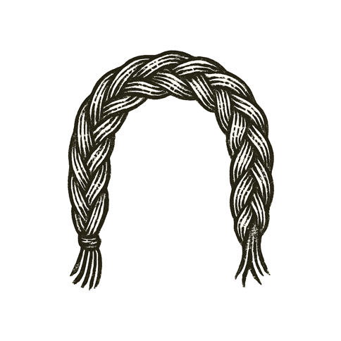

A child sat by a small fire, stars spinning overhead. An elder traced constellations with a gnarled finger: a hunter's bow, a serpent's coil, a goddess' gaze.

"Long before cities and kings," the elder whispered, "we looked up and made stories. We named what we couldn't reach. We wove the darkness with meaning so we wouldn't feel alone."

The child's eyes reflected the flames and the stars --- two fires, one near, one eternal.

Far from this quiet circle, others looked up with different names, different prayers. Some found solace. Some sharpened swords. Some twisted stories to claim power over others.

Above them all, the same night sky held the same truths --- patient, cold, and unclaimed.

---

*Tonight, for a moment, the child felt the stories not as boundaries, but as bridges --- strands that could yet be rewoven into something new, something shared.*
