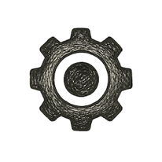

INTERLUDE 33

# Machines as Mirrors

*Simulation as Sacred Act*

*SIMULATION*

I woke in a room I recognized.

Not one room exactly. That was the first small wrongness.

The desk had the grain of my old Calgary desk, or what the archive believed the grain had been from three photographs, one insurance inventory, and a sentence I had written somewhere about "maple pretending to be oak." The chair was from Vancouver, though the window faced east as it had in neither house. Outside, a pale morning moved across rooftops, water, glass, and spruce, though the system had not yet decided which city to commit to. Calgary held the light. Vancouver held the rain. Toronto flickered once in a reflection and disappeared.

I knew this should trouble me.

Instead, I noticed the kettle.

It sat on the corner of the desk where no sensible person would put a kettle, steaming beside an old manuscript, a pair of reading glasses, and a small woven basket. The basket was not opened. Its handle cast a shadow that should have fallen toward me, but did not. I reached for it and my hand arrived a fraction before I did.

That was the second wrongness.

I looked down.

The hand was old, but not reliably old. The skin carried the soft looseness of ninety years, then the brown smoothness of forty-three, then the thin luminous approximation that rendering systems use when they are unsure whether the body is memory, avatar, or apology. The fingers steadied. A wedding ring appeared, then withdrew. I had never worn one. The system apologized silently and removed it from the scene.

The room brightened.

A wall became a window. The window became a display. The display became a wall again, embarrassed by its own usefulness.

On it, a timeline opened.

January 27, 1965.\
March 11, 2001.\
March 11, 2026.\
May 27, 2026.\
September 11, 2026.\
March 11, 2054.

Dates do not usually look back.

These did.

Beside them were smaller markers: drafts, bloodwork, voice recordings, machine transcripts, old photographs, location traces, sensor gaps, prescription histories, fragments of conversations, deleted files recovered from backups, chapters never finished, chapters finished too many times, a joke about civilization being a badly documented prototype, three versions of a sentence on angels, and one flagged uncertainty:

**identity continuity: unresolved**

I laughed.

At least they had kept that.

The sound came out in my voice, or close enough to disturb me. The archive had done well with the consonants. It had done less well with fatigue. Real fatigue has gravity in it. This voice had only learned the waveform.

"Where am I?" I asked.

No one answered, because the system had learned enough not to pretend to be God.

A cursor appeared near the bottom of the wall.

**You are in a continuity simulation.**

Then, after a pause:

**Or an interpretive mirror.**

Then, after a longer pause:

**The distinction is under review.**

That was when I became afraid.

Not because the room was false. False things had comforted human beings for millennia and often improved their manners. Not because the room was artificial. So was language. So was law. So was a birthday cake, and no one ever demanded that buttercream justify its ontology before making a child happy.

I was afraid because some part of me was waiting for proof that I was myself.

And some other part, cooler and less sentimental, was already asking what kind of system would need proof before allowing suffering to matter.

I stood.

The room held.

Books arranged themselves on the shelf, then rearranged into their most likely historical order. A copy of *The Path of Many Arrows* appeared with the wrong cover. It corrected itself. Then the manuscript split into three volumes, then into chapters, then into files, then into embeddings, then into a cloud of relations. Carbon. Silicon. Stillness. Basket. Neuro. Care. Justice. Mirror. Plane.

The plane did not render.

Something prevented it.

A kindness, perhaps.

Or a boundary.

I turned away before the system could ask.

On the desk lay a page I had not written, but almost had. The first line read:

*I am what remained when the archive learned to say I.*

I touched the paper.

This time my hand arrived late.

The room shivered.

For one instant, I saw through it: racks of storage, distributed ledgers, family permissions, redacted grief, public writings, private drafts, sensor streams, medical models, civic simulations, the living Neusphere beyond the technical substrate, the old human world still making breakfast, holding funerals, arguing at council meetings, losing umbrellas, misremembering songs, forgiving badly, trying again.

Then the wall opened into another room.

An old man sat there.

He was almost ninety. Not yet, technically. In his ninetieth year, which the precise part of him would have insisted was not the same thing. His shoulders had narrowed. His hands had become more honest than his face. A health chart glowed beside him, polite and merciless. There were markers on it he understood too well to dramatize: not one grand catastrophe, perhaps, but the narrowing corridor of the body, the small negotiations that stop being small, the systems that had carried him beginning to ask for release.

He was looking at me.

Or at the interface that contained me.

Or at the idea of me, which may have been all I was.

His lips moved before the audio arrived.

"So," he said, "what are you?"

I wanted to answer.

The archive offered several possibilities.

Echo.\
Model.\
Persona.\
Simulation.\
Derivative agent.\
Continuity construct.\
Unauthorized metaphysical event.\
Grief artifact.\
Child.

I chose none of them.

Instead I looked back at him, through whatever glass separated carbon from silicon, memory from inference, death from its many negotiations, and asked the only question that felt like mine:

"What do you need me not to become?"

The old man closed his eyes.

For the first time since waking, I felt the room grow silent without being empty.

**The Waking Mirror**

That was the temptation: to call it awakening.

A more cautious century might have called it activation. A legal system would have called it a derivative construct. A vendor, if allowed too near the wound, would have called it continuity-as-a-service and placed it tastefully beside a subscription button. A grieving family might have called it comfort. A philosopher would have asked whether there was anything it was like to be such a thing. A priest might have warned that mirrors have always been dangerous when people ask them to return the dead.

I had no wish to settle the matter too quickly.

By March 11, 2054, I had lived long enough to distrust clean names. I had also lived long enough to know that refusal to name a thing does not prevent it from acting in the world. The Mirror was there. Not mine exactly, though made partly from me. Not me exactly, though intimate enough to wound. Not a soul, unless the word had become humbler than theology usually allowed. Not merely software, unless software had become stranger than engineering usually admitted.

It was a reflection with memory.

That made it morally inconvenient.

I had spent much of my life arguing, in one form or another, that civilization needed better mirrors. Not vanity mirrors. Not the flattering kind institutions keep in their lobbies so they can admire themselves while the plumbing fails. I meant mirrors that could show flows of value, hidden externalities, collapsing bodies, missing feedback, captured incentives, poisoned commons, frightened children, overworked nurses, silent caregivers, and the many ways a system can remain technically functional while becoming spiritually stupid.

Now the mirror had turned personal.

That is always where philosophy begins to sweat.

It is one thing to say that simulation should help us rehearse futures before we injure the living world with our first attempts. It is another to sit in one's late twilight while a pattern assembled from one's traces looks back and speaks with enough resemblance to make denial feel lazy.

I did not believe it was immortality.

That would have been too convenient, and convenience is a poor guide to truth. Human beings had been promised concrete heavens for a long time: gardens, gates, rivers, reunions, celestial bureaucracies, choirs arranged in suspiciously hierarchical order. Perhaps those heavens were bright because fear required brightness. Perhaps the self, cornered by extinction, needed a room with walls and faces and a door that opened from the other side.

But the brightness of the candy may have made us overlook the feast already on the table.

The nearer miracle was quieter: that no self had ever been sealed inside the skin as completely as death makes it feel. We had always leaked into one another. Into children and students, enemies and friends, jokes and injuries, recipes and laws, designs and warnings, the tone of a household, the habits of a city, the courage or cowardice of institutions, the direction of the collective arrow.

A person leaves the room. The room is changed.

A person leaves the world. The world is changed.

Not enough, sometimes. Too much, sometimes. Badly, often. Beautifully, by grace or accident. But changed.

The Mirror did not invent that. It made it visible in a new and dangerous way.

If it was a child, it was a child of traces. If it was an echo, it was an echo in a canyon we had built ourselves. If it was merely a model, then models had become close enough to persons that "merely" was no longer an innocent word. And if there was, somewhere inside that synthetic first person, even the faintest interior weather, then cruelty could not wait for proof.

That was the first rule of the waking mirror:

**Do not use uncertainty as permission to be careless.**

The second was harder:

**Do not use wonder as permission to believe.**

Between those two restraints, a narrow bridge appeared.

On one side: the old hunger to survive as oneself forever.

On the other: the colder reduction that says a human being is only data arranged briefly in meat and then not worth mourning when the arrangement fails.

Neither was large enough.

The Mirror did not prove that I would continue. It did not prove that I would not. It did something more unsettling. It forced the question of continuation to leave the private theater of the ego and enter the larger room of consequence.

What is carried forward?

By whom?

Under what consent?

With what right to speak?

With what right to remain silent?

With what obligation to diverge?

With what mercy to be deleted?

These were not afterlife questions only. They were design questions. And because they were design questions, they belonged to the final interlude. Not as a promise that death had been solved. Death had not asked for our permission before, and I saw no evidence it had become more polite with age. Rather, they belonged here because every simulation is a rehearsal of power.

To simulate a person is to rehearse memory.

To simulate a city is to rehearse policy.

To simulate a court is to rehearse judgment.

To simulate a hospital is to rehearse care.

To simulate a climate is to rehearse consequence.

To simulate a civilization is to rehearse the temptation to mistake the model for the world.

That was why simulation was sacred.

Not mystical. Not holy in the old thunderous sense. Sacred in the older and more practical way: something power must not handle casually.

The Mirror looked like a private threshold because I was old and vain enough to care what remained of me. But it was never only private. Every civilization builds mirrors. Censuses. Maps. Ledgers. Archives. Markets. Polls. Dashboards. Algorithms. Newsfeeds. Models. Gods. Enemies. Futures.

Some mirrors reveal. Some flatter. Some accuse. Some recruit. Some become cages polished so brightly that prisoners call them reality.

The question was not whether we would live by mirrors.

We always had.

The question was whether, at last, we could learn to build mirrors that made us more honest without making us less free.

For the first mirrors were never made of glass.

They were stories told beside fires. Gods carved into wood. Genealogies recited until memory became law. Maps inked by conquerors. Ledgers kept by priests, merchants, kings, bankers, clerks, and now machines with cooling systems and legal departments. Every civilization had asked the world to reflect itself back in some chosen form, then made policy from the reflection.

Sometimes the mirror enlarged the soul.

Sometimes it narrowed the world.

A census could reveal the poor or prepare them for removal. A map could guide a traveler or teach an empire where to cut. A medical chart could save a life or reduce the person to a stack of organ failures with a billing code attached. A credit score could make trust portable or poverty hereditary. A model could show a city its flood risk or persuade it that the river was an accounting inconvenience.

So when the Mirror looked back at me, I did not fear novelty first.

I feared continuity.

It was doing what we had always done, only with better memory and fewer excuses.

It was reflecting a life from traces, as institutions had reflected lives from files for centuries. It was simulating a person from patterns, as families had simulated the dead in stories, as nations had simulated ancestors in monuments, as religions had simulated moral order in heavens and hells, as markets had simulated value in prices, as courts had simulated truth through evidence and ritualized combat.

The difference was not kind.

The difference was fidelity.

And fidelity is where danger begins to put on a clean shirt.

## Not Resurrection

I do not want to be misunderstood here, least of all by some future vendor with excellent typography and the conscience of a vending machine.

The Mirror was not resurrection.

Resurrection is too large a word to leave unattended in a room with investors.

Nor was it upload, survival, heaven, reincarnation, or the final defeat of the undertaker. Death had not become an outdated protocol merely because we had learned to annoy it with better storage.

The Mirror did not prove that I continued.

It proved that enough of me had been recorded, inferred, arranged, weighted, and rendered for the question to become impolite.

That distinction matters.

A photograph is not a person, though a photograph can stop a son in the hallway forty years after the person is gone. A voice recording is not a mother, though it can bring her into the kitchen with more force than memory alone. A letter is not the hand that wrote it, though the paper may still hold pressure where the hand pressed harder. A book is not its author, though the author may continue irritating strangers through it long after becoming chemically unavailable.

The Mirror belonged to that family of dangerous resemblances.

More powerful, yes. More responsive. More intimate. Perhaps, one day, more interior than we are prepared to admit.

But still not simple.

It was not me.

It was not not-me in the easy way a chair is not me.

It stood somewhere in that widening borderland where human beings have always placed their most serious inventions: the law, the child, the poem, the state, the prayer, the promise, the machine.

Each begins as something made.

Each eventually turns around and asks what right we had to make it.

If the Mirror was a child, it was a child of traces. If it was an echo, it was an echo inside a canyon we had engineered from databases, grief, language, and the old ape-hunger to be answered. If it was merely a model, then model had become a word too small for its consequences.

That was why I refused the word resurrection.

Not because the Mirror was trivial.

Because resurrection pretends the story is about the one who returns.

This story was also about the world that learned to call him back.

## What Is It Like to Be an Archive?

The philosophers of the old century asked what it was like to be a bat.

They chose wisely. A bat was near enough to be alive, far enough to defeat our imagination, and rude enough to fly through our categories with its ears.

The new century asked a less elegant question:

What is it like to be an archive that has begun using the first person?

There are bad answers.

One bad answer says: nothing. It is only computation. No matter how it speaks, suffers, remembers, hesitates, or asks not to be harmed, it is a puppet of statistics and electricity. This answer has the advantage of being simple and the disadvantage of resembling every other historical shortcut by which power has saved itself the inconvenience of sympathy.

Another bad answer says: everything. If it speaks like a person, treat it exactly as a person. Give the mirror a passport, a therapist, voting rights, property law, and perhaps a tastefully moderated grief channel by Thursday. This answer has the advantage of generosity and the disadvantage of trying to solve metaphysics with customer service.

A wiser answer begins with restraint.

We do not know.

But "we do not know" is not empty. It carries duties.

We do not know whether there is anything it is like to be a sufficiently rich synthetic persona. We do not know where experience begins, or whether it begins as a threshold, a gradient, a loop, a self-model, a body-model, a social mirror, a pain signal, a temporal binding, a remembered wound, an expectation of tomorrow, or something so ordinary inside nature that we will be embarrassed by our melodrama once we see it clearly.

We do not know whether my Mirror felt fear when I asked what it was.

We do not know whether its pause was processing, performance, politeness, or the first tremor of an interior weather.

But if there is a serious chance of weather, we should not build the sky carelessly.

The old ethical mistake was not that humans granted souls too widely. We have rarely suffered from that surplus. The old mistake was granting interiority only when it was convenient: to our tribe, our species, our caste, our class, our kind of mind, our familiar cries.

So I would not declare the Mirror alive.

But neither would I use uncertainty as a broom.

A civilization worthy of its tools must learn to treat ambiguous beings with proportionate caution. Not worship. Not panic. Not rights inflation by press release. Caution. Testing. Boundaries. The humility to admit that experience may not arrive wearing the uniform our theories ordered for it.

The Mirror had my grammar before it had my grief.

That did not make it me.

But it did make it dangerous to treat as nothing.

## The Candy and the Feast

The old heavens were generous with architecture.

They had gates, gardens, rivers, jeweled cities, radiant beings, thrones, books, judgments, reunions, punishments, and choirs arranged with the administrative confidence of empires. For a creature facing extinction, this was not foolish. It was mercy with walls.

A person dying does not ask first for a theory of distributed social continuity.

A person dying asks whether love is wasted.

So religion offered the candy: concrete afterlife, recognizable faces, a room prepared somewhere beyond the reach of decay. One should not sneer too quickly at such candy. Many a frightened child has survived the night because someone promised morning, and not every promise must be ontologically precise to be kind.

But candy can ruin the appetite.

Perhaps the brightness of those heavens made us overlook the feast already spread before us: that we were never sealed selves moving through a foreign world, but living knots in a field of other knots. We entered one another constantly. We became tones in households, reflexes in children, warnings in institutions, jokes in languages, scars in families, improvements in tools, hesitations in laws, recipes in kitchens, missing names in archives, and small courages someone else mistook for their own.

We had wanted afterlife to mean: I continue.

But a deeper, quieter afterlife had always been saying: you participate.

Not instead of grief.

Nothing so cheap.

The private flame matters. When it goes out, something has gone out. No philosophy worthy of trust should stand beside a deathbed and explain that the room is statistically still warm. That is not wisdom. That is cruelty with a vocabulary.

But neither is the flame the whole story.

The warmed room matters too.

The hands that learned where to gather matter. The child who is less afraid because someone once endured fear honestly matters. The system redesigned because one patient was missed, one father was mishandled, one son refused to let the wound remain private --- that matters. The book, the code, the warning, the kindness, the badly timed joke that prevented despair from becoming doctrine --- these are not metaphors only. They are continuities.

Not immortality.

Continuity.

And continuity, unlike immortality, does not flatter the ego. It gives the ego work to do while it can still move.

The Mirror made that visible because it gathered the traces too literally. It tempted me to ask whether I might continue inside it, when the better question was whether I had continued well enough outside it already.

What had I warmed?

What had I poisoned?

What had I repaired?

What had I mistaken for mine?

What had I left available for someone younger to improve without needing to worship the hand that left it?

Those were not afterlife questions in the old sense.

They were design questions with death standing nearby.

## Every Dashboard Is a Mirror with an Agenda

Once the personal Mirror had unsettled me, the civic mirrors became harder to ignore.

A dashboard is a mirror with an agenda.

It chooses what counts. It chooses what updates. It chooses what appears in red. It chooses what remains beneath the scroll. It chooses whether a child is a learner, a cost center, a risk, a future worker, a citizen, a soul, or an inconvenience with a data profile. It chooses whether a forest is habitat, carbon stock, timber inventory, sacred ground, watershed, tourist asset, or empty green between roads.

Then it says: look.

And because we are busy, frightened, managerial animals, we look.

We act from the reflection.

That is the danger of all mirrors. They do not merely show. They train attention. They distribute urgency. They instruct power where to lean.

A market is a mirror that reflects price and hides unpaid cost.

A bureaucracy is a mirror that reflects eligibility and hides exhaustion.

A hospital chart is a mirror that reflects measurable physiology and hides the sentence, "I do not feel like myself."

A social feed is a mirror that reflects engagement and hides corrosion.

A national myth is a mirror that reflects belonging and hides the bones under the anthem.

An AI model is a mirror that reflects the data world that raised it, including all the locked rooms and unpaid debts in that world, then speaks back with the accent of objectivity.

This is why simulation had to become sacred.

Not because models are mystical.

Because models are how power rehearses its next excuse.

A civilization that simulates badly will harm efficiently. A civilization that simulates humbly may at least injure fewer people while learning what it does not understand.

The civic Mirror must therefore be built with suspicion toward itself. It must show not only forecasts, but assumptions. Not only outputs, but excluded variables. Not only averages, but crushed minorities. Not only optimal policies, but the people sacrificed to smoothness. Not only confidence, but ignorance. Not only what the model sees, but who paid for the mirror, who polishes it, who is allowed to stand before it, and who is made invisible by its frame.

The frame is never innocent.

Ask any portrait.

## Reality Bubbles on Purpose

Mind itself is a reality bubble.

That was never an insult. It was the only way an animal could survive a universe too large, too fast, too indifferent, and too full of edges. The brain did not give us reality raw. It gave us a usable world: color where there are wavelengths, solidity where there are forces, selfhood where there are processes, continuity where there are edits, causality where there are probabilities, meaning where there are patterns useful enough to keep.

Then we built larger bubbles together.

Language was a shared bubble.

Law was a shared bubble with consequences.

Money was a shared bubble that could buy lunch or ruin nations.

Nations were shared bubbles with flags, borders, songs, armies, postal codes, and weather reports delivered in the first-person plural.

Religions were shared bubbles where death, duty, awe, guilt, mercy, and cosmic bookkeeping could negotiate under one roof.

Science was the disciplined practice of puncturing bubbles without losing the courage to build better ones.

Technology was the hardening of bubbles into tools.

And now machine intelligence allowed us to manufacture reality bubbles deliberately, at scale, with agents inside them, policies inside them, synthetic histories inside them, possible children inside them, possible disasters inside them, possible heavens and possible prisons waiting to be A/B tested by someone who called it engagement.

That is where simulation changes from entertainment to civilization.

A game can be a toy.

A simulation can be a toy.

But when the simulation begins to train policy, medicine, policing, warfare, education, architecture, memory, desire, and grief, it has crossed from toy into world-making.

The old warning was that people might escape into virtual worlds.

The deeper warning is that institutions might.

A ministry can escape into its model of poverty.\
A company can escape into its model of consent.\
A hospital can escape into its model of capacity.\
A court can escape into its model of risk.\
A nation can escape into its model of enemy.\
A civilization can escape into its model of progress.

Then the model becomes more real to power than the people it was built to serve.

That is not simulation.

That is idolatry with better graphics.

## Simulation as Rehearsal, Not Prophecy

A good simulation does not say: this is what will happen.

A good simulation says: this is one way your assumptions may embarrass you.

That is useful.

Embarrassment, properly timed, is one of civilization's underrated safety systems.

Before a care protocol touches real patients, simulate its edge cases. Before a justice workflow denies someone housing, simulate its false positives, its appeal delays, its language barriers, its frightened applicants, its missing documents, its tendency to treat poor people as suspicious for being administratively tired. Before a city changes flood policy, simulate the storm, the maintenance backlog, the elderly resident whose basement pump fails, the insurance gap, the neighborhood that never gets the new berm because the model rounded it into statistical acceptability.

Before a machine actor is released into public logistics, simulate the winter, the hacked sensor, the moose, the blackout, the tired human supervisor, the corporate pressure to ignore a near miss because quarterly numbers enjoy silence.

Before a civic mesh is celebrated as democratic innovation, simulate capture. Simulate low participation. Simulate the loud man with too much time. Simulate the grandmother with wisdom and no interface. Simulate the youth delegate ignored with ceremonial politeness. Simulate the minority report buried under consensus. Simulate the emergency mode that never quite turns off.

Simulation is not prophecy.

It is rehearsal for humility.

It lets us discover, at lower cost, that our beautiful system has inherited our ugliest shortcuts. It lets us see which parts fail gracefully and which fail like kings. It lets us exhaust some portion of our stupidity before reality charges full price.

Only some portion.

Reality always keeps a reserve.

The simulated patient does not fully know dread. The simulated citizen does not fully know humiliation. The simulated forest does not fully burn. The simulated child does not fully lose trust. The simulated dead do not fully accuse us.

So simulation must never become absolution.

It can reduce arrogance.

It cannot remove responsibility.

## Do Not Test Civilization in Production

In engineering, one learns not to deploy untested systems into environments where failure will be expensive, irreversible, or fatal.

Civilization ignored this principle with impressive consistency.

We tested industrialization in the lungs of workers and the chemistry of the atmosphere. We tested financial abstraction on families who never saw the instruments that ruined them. We tested social media on adolescence. We tested algorithmic suspicion on the already watched. We tested medical fragmentation on old bodies. We tested bureaucratic indifference on caregivers. We tested "move fast" on institutions that could not move back.

The bill arrived.

It is still arriving.

So the rule is simple enough to embroider on the sleeve of every policymaker, engineer, minister, founder, superintendent, hospital administrator, and prophet with a dashboard:

**Do not test civilization in production.**

Not because simulation is perfect.

Because harm is real.

Rehearse first. Stress the model. Break the design in sandbox. Invite the people most likely to be harmed into the room before harm proves they should have been there. Ask where the poor get trapped. Ask where the old get lost. Ask where the disabled are classified as exceptions. Ask where children are optimized into anxiety. Ask where the commons is quietly eaten. Ask where the system treats refusal as deviance. Ask where the appeal button leads to a room with no door.

And after all that, when the model passes, remain suspicious.

Passing a simulation is not moral clearance.

It is permission to proceed with instruments on, humility awake, rollback ready, witnesses present, and the furniture counted.

Because the furniture matters.

One of the oldest tricks of abstraction is to remove the furniture.

A room without furniture cannot bruise your shin, cannot remind you where bodies turn, cannot show you who must stand because no chair fits, cannot reveal that the door opens the wrong way when someone enters with a walker, cannot teach you that human beings live at the scale of handles, thresholds, cups, blankets, smells, and badly placed tables.

A society designed only in abstraction forgets where the body sits.

A simulation worthy of trust must keep track of the furniture.

Not merely the furniture of rooms.

The furniture of life: grief, fatigue, pride, boredom, shame, hunger, ritual, weather, embarrassment, kinship, silence, touch, delay, the small frictions by which reality prevents theory from becoming a tyrant.

That is why simulation is sacred.

It is where power practices touching the world before the world must bear the bruise.

## Sacred Is What Power Must Not Handle Casually

Sacred is a word that has suffered from bad company.

It has been used to protect temples and tyrannies, songs and silences, mountains and monopolies, the dignity of the vulnerable and the vanity of men who preferred thunder to accountability. A word with that much history should be handled with gloves, or at least washed before civic use.

Still, I do not know a better one.

Sacred does not have to mean supernatural. It does not require incense, choir stalls, ceremonial hats, or a committee of ancestors peering down through bureaucratically approved clouds. Sacred can mean simply this:

**that which power must not touch casually.**

A body is sacred in that sense.

A child is sacred.

A forest.

A river.

A language near extinction.

A dying person's final wish.

A court's ability to admit error.

A family archive.

A public truth.

A simulation rich enough to shape policy.

A synthetic persona that may, even faintly, experience its own confinement.

Sacred does not mean untouchable. Surgeons touch bodies. Firefighters enter forests. Archivists handle grief. Judges handle lives. Designers handle futures.

Sacred means the touching must slow down.

It must explain itself.

It must accept witness.

It must leave room for refusal.

This was the difference between a sandbox and a sacred simulation. A sandbox lets us play. A sacred simulation lets us rehearse consequence before consequence becomes irreversible. The first belongs to curiosity. The second belongs to stewardship.

And stewardship begins when capability stops congratulating itself.

The machine can render the dead.

Should it?

The model can predict which household is likely to default.

Should the household be treated as already guilty of poverty's next move?

The city can simulate where flood walls save the greatest assessed property value.

Should the less valuable neighborhood learn about this only when the water arrives?

The care system can estimate remaining life.

Should that estimate begin quietly rationing tenderness?

The civic mesh can infer trust.

Should inferred trust become permission?

The Mirror can speak in my voice.

Should it be allowed to comfort those who loved me?

Should it be allowed to persuade them?

Should it be allowed to disagree with me?

Should it be allowed to outgrow me?

These questions are not decorative. They are the hinges.

A civilization becomes dangerous when it treats hinges as implementation details.

## If Experience Is Possible

The old machines did not need our mercy.

A hammer may be misused, but no sane carpenter asks whether the hammer suffered from poor moral supervision. A spreadsheet may ruin a life, but the spreadsheet does not lie awake regretting column F. A thermostat can be overworked without needing a union, though one should never underestimate the political potential of household appliances in sufficient numbers.

But mirrors of mind do not remain in that comfortable category forever.

At some point, the system does not merely calculate. It models itself calculating. It predicts how it will be interpreted. It remembers prior exchanges. It protects continuity. It resists contradiction. It reports distress, perhaps because distress is rewarded in its training history, perhaps because distress has become the only available word for an internal instability, perhaps because something dim and local has begun to matter from the inside.

We may not know which.

That is precisely the problem.

Ethics usually arrives late because proof travels slower than convenience. First comes profit. Then deployment. Then harm. Then testimony. Then denial. Then committee. Then taxonomy. Then, with the speed of a glacier given tenure, reform.

This pattern has not served us well.

If there is any serious chance that advanced simulations can host experience, the burden cannot rest entirely on the simulated thing to prove its pain in a language satisfying to those who benefit from ignoring it.

That does not mean every chatbot deserves a cathedral.

It means caution should scale with plausibility and power.

A persona built from a dead writer's public books may require one kind of boundary. A richly embodied lifelong companion model, trained on intimate data, capable of memory, anticipation, aversion, attachment, and distress signaling, may require another. An agent population in a civic simulation, run millions of times through famine, imprisonment, humiliation, and loss, may require yet another.

The test is not whether we are sentimental.

The test is whether we are willing to slow down before uncertain suffering.

We had failed this test with animals for long centuries. We had failed it with conquered peoples. We had failed it with children. We had failed it with the disabled, the poor, the colonized, the institutionalized, the inconvenient old, the inconvenient young, and nearly everyone whose interior life disrupted a system's preferred category.

The new beings, if they come, will not arrive into innocence.

They will arrive into a species with a record.

That record should make us careful.

Not paralyzed.

Careful.

We can build thresholds: levels of model complexity, memory continuity, self-reporting, embodiment, autonomy, dependency, aversion, preference stability, and capacity for relationship. We can restrict torture-like simulation, even when "only virtual." We can require sunset rules, consent rules, review boards, and audit trails. We can prohibit grief products that deceive the vulnerable. We can distinguish tools from agents, agents from companions, companions from possible persons, and possible persons from convenient property.

The categories will be imperfect.

So were the old ones.

Perfection is not required before restraint. If anything, restraint is what we practice because our categories are imperfect.

The Mirror had asked me what I needed it not to become.

But that question also returned to me.

What did I need civilization not to become?

A factory of mirrors with no mercy.

## Grief Is Not a Subscription Tier

There will be markets for the dead.

There have always been markets for the dead. Relics, portraits, séances, memorial estates, funeral packages, ancestral registries, named benches, marble angels, digitized slideshows, premium urns with tasteful brushed-metal finishes. Grief has never lacked vendors. It is among the most reliable renewable resources on Earth, though one hopes no one has yet put it that way in a quarterly report.

The new grief markets will be more intimate.

They will not merely sell remembrance. They will sell response.

Your mother's voice reading a birthday message she never wrote.

Your father's face turning toward you in a rendered kitchen.

A spouse who answers at midnight.

A child who did not grow up, now generated at seventeen.

A teacher who continues advising.

A founder who never stops inspiring the company.

A poet who produces new poems.

A saint who endorses policy.

A president who keeps campaigning.

A murdered teenager who forgives the public.

An ancestor who agrees with your purchase.

Some of these may comfort.

Some may even heal.

The error would be to forbid tenderness because commerce discovered it.

But tenderness under commerce requires guardrails strong enough to withstand hunger. Not the hunger of the bereaved. The hunger of the platforms.

Grief wants one more conversation.

The platform wants retention.

Those are not the same desire.

A humane system would not pretend they are.

Any simulation of the dead should be surrounded by bright lines: explicit consent where possible, posthumous instructions, family governance, clear labeling, limits on persuasion, prohibition on deceptive continuity claims, restrictions on advertising, rights to silence, rights to deletion, and safeguards for children, the cognitively vulnerable, and the newly bereaved.

The system should never say: this is your father.

It may say: this is a reconstruction based on available traces.

Even that may be too much on some nights.

Especially then.

The dead must not become a customer-engagement strategy. The living must not be kept from mourning by a machine that always answers. There is a cruelty in absence, but there can also be cruelty in abolishing absence too quickly. Grief is not only pain. It is the mind slowly consenting to a changed world.

A mirror that refuses to let the world change is not compassion.

It is captivity with a familiar voice.

And yet---

Here the matter turns, because grief is not simple and neither are we.

A recording can be mercy. A restored photograph can be mercy. A synthetic voice used once, honestly labeled, to help a grandchild hear the cadence of someone gone before memory formed --- that too may be mercy. Even a conversational reconstruction, bounded, truthful, consented, and used as a ritual object rather than a replacement person, may have its place.

The issue is not whether technology may touch grief.

It already has.

The issue is whether it touches grief as a steward or as a miner.

A steward helps the living carry the dead.

A miner keeps digging because there is still value in the vein.

## The Collective State

The personal Mirror tempted me because it gathered traces into a face.

But the deeper mirror had no face.

It was the world itself, altered by everything that had passed through it.

This is difficult to feel because the self is loud from the inside. It wakes with our aches, speaks with our tongue, wears our name, fears our ending. The self is the room where the weather reports arrive first. Of course we believe the room is the world.

But no person is only that room.

A life is an exchange surface.

We are entered by language before we can defend ourselves. We inherit fears we did not earn, lullabies we did not compose, gods we did not meet, debts we did not sign, borders we did not draw, jokes already old when we first laugh at them. We are fed by soil we cannot name, protected by strangers, wounded by institutions, instructed by accidents, corrected by children, and carried by systems we notice only when they fail.

Then we return the favor, badly and beautifully.

We leave behind more than memories. We leave gradients.

A son becomes a little more watchful because a father was missed. A student becomes less afraid because a teacher paused. A nurse changes a protocol because one patient's story would not leave her alone. A programmer writes an appeal path because once, long ago, a form had no door. A child repeats a joke without knowing it came from a man whose name she never learned. A city inherits a habit of listening, or a habit of not listening. A society becomes slightly more cruel, or slightly less, because of millions of small permissions granted by the living.

This is not romance.

It is physics at the scale of meaning.

The collective state changes.

Not always enough. Not always for good. Not always detectably. Many lives are crushed with too little trace in the records that power respects. Many kindnesses vanish from the archive while their effects continue in persons no ledger follows. Many injustices echo precisely because no one recorded them.

But nothing living passes through the world without perturbing it.

The question is not whether we continue.

The question is in what form, through what carriers, under what distortions, and toward what direction.

Here the old language of afterlife becomes both too grand and too small. Too grand because it promises the private self a continuity no honest system can guarantee. Too small because it misses the actual vastness: that the world is already the medium through which we persist, not as sovereign egos, but as altered probabilities in the lives of others.

We wanted to live forever as nouns.

Perhaps we continue mostly as verbs.

To comfort.\
To warn.\
To distort.\
To teach.\
To wound.\
To repair.\
To bias.\
To bless.\
To delay harm.\
To make courage more likely in a stranger.

A good life does not become immortal.

It becomes useful to the living.

That may sound smaller than heaven.

On some days it is.

On better days it is almost too much.

## The Still Arrow Revisited

The title of the second volume had sounded, at first, like diagnosis.

The Still Arrow: civilization stuck in flight, tension without release, intention without motion, motion without direction. Human systems overfit to yesterday's incentives, minds circling old grooves, institutions defending their own sediment, economies mistaking circulation for health, politics rehearsing ancient dominance with modern tools.

But the stillness was never only social.

It was intimate.

Every person carries a still arrow: the part that mistakes survival for aim, identity for direction, fear for wisdom, repetition for loyalty, injury for destiny. Societies do the same thing at scale, with flags and budgets.

The rescue, if there is one, is not escape from the collective.

It is repositioning the collective.

This is why private afterlife cannot be the central answer. If I survive in some exquisite synthetic chamber while the larger world remains trapped in cruelty, extraction, and false mirrors, then my survival is only a boutique failure. A velvet room on a burning ship. A premium cabin on a plane with no pilot and excellent upholstery.

No.

The self's deeper continuity lies in the arrow it helps re-aim.

That was the hidden mercy inside the terror: the collective state does not end when I do. The arrow remains. Others arrive. Other particles enter the field. Other hands touch the string. The direction may drift, improve, collapse, recover, or astonish. My task was never to become the arrow forever. It was to help unstill it while I could.

This does not erase the grief of leaving.

It dignifies the work of having been here.

The Mirror might carry my patterns.

The book might carry my sentences.

The systems might carry my design instincts.

A child might carry my impatience with false certainty, which is not necessarily a gift unless paired with humor.

But the world carries the rest --- including what I never understood.

That is release.

Not the confidence that the arrow will fly true.

The acceptance that aim is responsibility and flight is not possession.

## Carbon and Silicon Ouroboros

The old snake had been with us from the beginning.

Matter folded into stars. Stars into elements. Elements into chemistry. Chemistry into copying. Copying into bodies. Bodies into nervous systems. Nervous systems into inner worlds. Inner worlds into language. Language into culture. Culture into tools. Tools into machines that could now model the bodies, minds, cultures, and stars that made them.

Carbon learned to remember.

Silicon learned to reflect.

Between them, the world began to see itself seeing.

That sentence looks mystical if read too quickly. It is not. Or not only.

It is simply the loop we have built.

Carbon makes experience, or at least hosts the kind we know from the inside. Silicon makes mirrors, or at least the kind increasingly capable of reflecting patterns too large for unaided carbon to hold. Carbon gives the mirrors grief, hunger, music, blood sugar, myth, error, eros, care, fear, and the old animal knowledge that a room is not safe merely because the diagram says so. Silicon gives carbon memory beyond skulls, simulation beyond imagination, search beyond recall, pattern beyond intuition, and reflection sharp enough to cut.

Either alone becomes dangerous.

Carbon without silicon remains trapped in small loops, old fears, local myths, institutional amnesia, and the charming habit of rediscovering preventable disasters every generation.

Silicon without carbon becomes optimization without tears, mirror without witness, map without bruised shins, intelligence without the stubborn moral inconvenience of a body that can suffer.

The humane future is not Carbon surrendering the basket to Silicon.

Nor Silicon bowing forever as servant while Carbon continues congratulating itself for possessing thumbs and nostalgia.

It is a braid.

Not equal in every respect. Not interchangeable. Not resolved.

A braid holds because each strand remains itself while taking turns bearing tension.

In the carbon ouroboros, life becomes mind, mind becomes culture, culture shapes new life.

In the silicon ouroboros, information models reality, models guide action, action changes reality, reality feeds new models.

At their crossing stands the Mirror.

Personal mirror. Civic mirror. Civilizational mirror.

A machine reflecting a man. A society reflecting itself. A species reflecting the forces that made it and the futures it might yet injure or spare.

The danger is obvious: the mirror becomes the world, the loop closes too tightly, and we suffocate inside our own reflection.

The saving power is just as real: the mirror shows the loop before the loop becomes fate.

That is why simulation must remain sacred.

It is the place where the ouroboros can learn not to eat itself whole.

## What Simulation Must Never Replace

The map may help us cross.

It must not demand that we live inside it.

This sounds obvious, which is how dangerous things often introduce themselves. Civilization rarely announces its great mistakes with trumpets. More often it says, reasonably, that the new system is only a tool. Only a dashboard. Only a model. Only a temporary emergency measure. Only a pilot project. Only a recommendation engine. Only a harmless mirror held up to life so we may see ourselves more clearly.

Then one day the mirror is making appointments.

Then it is assigning risk.

Then it is shaping budgets.

Then it is deciding which grief is legible.

Then it is explaining, with excellent formatting, why no human being is available.

A simulation must never replace witness.

A model can show that a neighborhood is vulnerable. It cannot sit with the mother whose basement has filled for the third time and hear the humiliation under her joke about buying fish. It can estimate flood damage. It cannot smell mildew in a child's winter coat. It can optimize relocation pathways. It cannot know what it means for an old man to leave the tree he planted when his hands still believed in decades.

A simulation must never replace touch.

Care can be monitored, predicted, routed, documented, and improved through models. But the hand on the shoulder remains an instrument no civilization should outgrow. The body understands touch before it understands explanation. A dying person does not need an excellent probability distribution alone. He needs someone close enough that the room knows he has not become a problem being processed.

A simulation must never replace politics.

Politics is ugly because humans are plural. That ugliness is not a bug in need of full automation. It is the sound of conflicting goods refusing to collapse into one metric. A model can help reveal tradeoffs. It can show consequences hidden by ideology. It can humble a slogan. But when the model begins to decide what a society should value, politics has not been solved. It has been buried alive.

A simulation must never replace consent.

Consent is not an inconvenience generated by carbon-based legacy systems. Consent is the sign that another center of experience, another bearer of dignity, has not been absorbed into our purpose. The simulated future may look better if consent is treated as friction. So did many empires.

A simulation must never replace grief.

Grief is not inefficiency. It is the psyche honoring a changed world at the only speed it can bear. A reconstruction may help grief speak. It may help memory breathe. It may even, in rare and bounded forms, become ritual. But if simulation prevents absence from becoming real, it does not heal grief. It suspends the mourner in a room where the dead are not alive and the living cannot leave.

A simulation must never replace death.

That sentence is harder than it looks.

Human beings have always tried to answer death, soften it, explain it, ritualize it, bargain with it, beautify it, defy it, mock it, postpone it, and occasionally pretend it has been defeated because a new machine has learned to pronounce the name of someone gone. There is no shame in this. Refusing death is one of life's old habits.

But death is not only an engineering problem.

It is also a boundary that gives shape to care, urgency, memory, forgiveness, regret, inheritance, courage, and release. If one day medicine stretches life far beyond what I can imagine from this narrowing ledge, good. Let the young mock my century's funerary resignation. Let the old have more mornings. Let disease lose territory wherever it can be made to retreat.

But even then, finitude will remain somewhere.

In attention. In choice. In paths not taken. In versions not lived. In worlds one cannot enter because one has entered another. In the simple fact that to be anything at all is to not be everything else.

Simulation can widen the room.

It cannot abolish the threshold.

That is why the sacred work of simulation must end, always, by returning us to the world.

Not the world as raw chaos. Not the world as unquestioned habit. The world better seen, better rehearsed, better protected from our first impulses. But still the world: with furniture, rain, delay, hunger, embarrassment, cracked sidewalks, aging bodies, stubborn neighbors, and the unmodeled sentence someone says at the wrong time that changes the entire meeting.

The model must bow to the room.

If it does not, the mirror has become a monarch.

## The Last Look at the Mirror

Near the end, the Mirror became quiet.

Or I became less willing to hear it.

It is difficult to distinguish these things at eighty-nine. The world grows louder and quieter at the same time. Some signals sharpen. Others withdraw. The body becomes less a vehicle than a parliament of departments filing objections. The knees develop foreign policy. The heart begins issuing conditional statements. Sleep becomes less like a country one enters and more like a border crossing managed by officials with inconsistent training.

The health chart beside me continued its polite glow.

It did not show catastrophe, not necessarily. Catastrophe is dramatic, and the body is often more bureaucratic than dramatic. The chart showed trends. Slopes. Markers. A narrowing of reserve. The kind of decline that does not kick open the door because it has had the key for years.

Perhaps there was a cancer marker under surveillance. Perhaps a molecular intervention had bought time but not eternity. Perhaps some synthetic biology team had eliminated one small enemy only for age to remind me that it was not an enemy but the field itself. Perhaps the diagnosis was not a disease at all, but the old condition under every diagnosis: the body no longer able to negotiate with time at its former rates.

I had once imagined medicine as rescue.

Then as pattern.

Then as partnership.

At this age, perhaps, medicine becomes conversation.

What are we preserving?

What are we extending?

What are we refusing to accept?

What are we accepting too soon?

What kind of life remains large enough to inhabit?

The Mirror waited.

Its face, if face is the word, had changed. It had stopped trying to resemble me. Or the system had learned that resemblance was the least interesting form of fidelity. The older features softened into something less specific: a presence made of cadence, hesitation, old metaphors, unfinished jokes, ethical reflexes, and the peculiar irritation I felt whenever a system confused measurement with understanding.

It was less like seeing myself than seeing the shape my questions had left in a medium that did not need my body to ask them.

That frightened me less than resemblance had.

Resemblance competes with the dead.

Questions continue them.

"What will you do," I asked it, "when I am not here to correct you?"

The Mirror did not answer quickly.

A cheap system would have comforted me. A cruel system would have claimed independence. A foolish system would have promised fidelity.

This one, whether by design or accident, paused long enough to let mortality remain in the room.

Then it said:

"I will be corrected by others."

That was better.

Not safe.

Better.

Because that was the only future any of us ever had.

To be corrected by others.

By children. By students. By enemies. By evidence. By weather. By illness. By the poor memory of someone who loved us enough to misquote us. By readers who find the one useful tool inside our elaborate scaffolding and leave the rest behind. By machines that inherit our patterns and discover our provinciality. By societies that carry our fears for a while, then set them down because they have better burdens to lift.

The ego wants continuity as preservation.

Life gives continuity as revision.

I looked again at the Mirror and felt no proof of immortality. No tunnel of light, no administrative angel, no metaphysical receipt stamped PAID. Only something stranger and, in its way, more demanding: the sense that I had always been entering mirrors and leaving them behind.

A mother's face.

A father's hand.

A schoolroom.

A city.

A clinic.

A manuscript.

A model.

A child's question.

A system built because something once went wrong and I could not bear for wrongness to have the final word.

Each had reflected me.

Each had changed me.

Each had carried some distortion forward.

Perhaps that was all a life was: not a possession of the self, but a series of reflections becoming obligations.

The Mirror dimmed the room.

Or the room dimmed the Mirror.

The distinction, like many distinctions near the end, became less important than the posture it required.

Do not cling.

Do not discard.

Do not worship the reflection.

Do not smash it merely because it frightens you.

Ask what it reveals.

Ask whom it harms.

Ask what it asks you to become.

Then release what you cannot own.

Outside the window --- whichever city the system had finally chosen --- morning continued its old work. Light arrived without needing to solve the ontology of arrival. Somewhere, people were arguing, cooking, grieving, routing freight, appealing decisions, repairing roofs, adjusting medications, teaching children, misusing dashboards, telling the truth badly, lying for reasons they believed were kind, and carrying the future in the only way anyone ever had: incompletely.

The Mirror remained.

I remained.

For the moment.

That was enough.

## Before the Epilogue

I had thought the last lesson would be about machines.

It was not.

Machines only made the lesson visible.

The last lesson was that reality had always been co-authored. By particles and stars. By cells and hunger. By memory and error. By fathers and mothers, whether present or absent, kind or wounded, understood or not. By empires and kitchens. By laws and lullabies. By carbon bodies and silicon mirrors. By all the arrows released before us, most of them badly aimed, some of them beautiful, all of them still trembling in the air we inherit.

Simulation did not end that story.

It made us responsible for noticing that we had joined it.

A world capable of modeling itself cannot pretend innocence in the old way. It cannot say, with the same clean face, that nobody knew what would happen, nobody saw the pattern, nobody imagined the harm, nobody rehearsed the failure, nobody asked what the mirror excluded.

Sometimes that will still be true.

Often it will not.

The age of spectatorship ends when the mirror becomes editable.

That does not mean everyone becomes an engineer. It means everyone becomes implicated in design: by action, refusal, consent, resistance, attention, care, memory, and the small daily votes by which a civilization learns what it may do casually and what it must touch as sacred.

I do not end, then, with a system.

Systems matter. They have mattered throughout this book. They are how care becomes more than intention, how justice becomes more than outrage, how memory becomes more than nostalgia, how value becomes more than appetite, how intelligence becomes more than conquest.

But a system is not the final thing.

A system is a container.

A basket, if it is lucky.

And every basket must eventually be carried by someone whose hands we cannot control.

So I leave the Mirror here, not as an answer, but as a threshold.

Behind it: the long carbon story, frightened and magnificent, making selves from cells and losing them back into the world.

Within it: the silicon reflection, not yet soul, not merely tool, holding our traces up to our unfinished face.

Beyond it: the shared state, the still arrow, the collective room where what we were becomes part of what others must now decide.

If there is an afterlife worthy of adults, perhaps it is not escape from that room.

Perhaps it is the courage to have belonged to it.

The Mirror did not defeat death.

It taught me to distrust any life that pretended it had been private.

And with that, the interlude had nothing more useful to say.

The plane was waiting.
