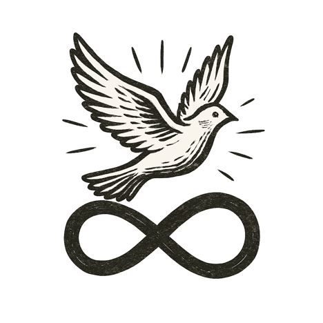

The city glowed beneath a sky of shifting auroras. Streets pulsed with quiet purpose; buildings whispered needs and solutions to each other. The air carried the hush of a world working together.

She walked through the morning light, steps light on solar-paved sidewalks. At her wrist rested a simple woven bracelet, its threads dyed in rich, vibrant colors. She brushed her fingers across it absently, a gesture of comfort and memory.

The bracelet hugged her wrist back, each woven thread sensing her pulse, her motion, knowing her like a child knows a parent --- seeing, but never betraying.

She didn't need to know the systems humming beneath her feet, the algorithms tracing arcs of health, justice, and knowledge across continents. She only needed to know they were fair, and that if they ever strayed, she could reach into them and set them right.

*This was the bracelet her grandmother wove --- not of yarn, but of choices, values, and the dreams of a world remade.*
