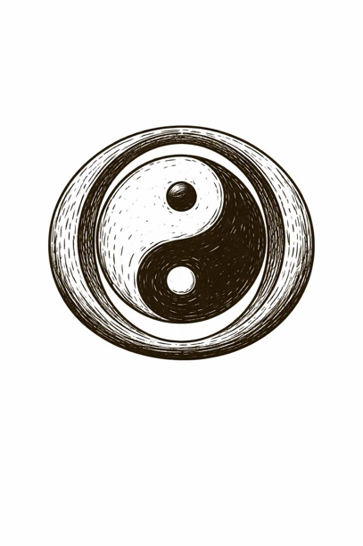

In the beginning, the Chinese storytellers say, there was only an egg.

Not a fragile breakfast thing---an absolute one: a sealed whole where sky and earth, light and dark, order and chaos were mixed into a single, undifferentiated sleep.

Then Pangu woke.

He did not *discover* a world. He *made* one---by splitting it. With every breath, the light rose and the heavy sank; with every day, the distance grew. The universe became navigable only because someone did the violent, careful work of separation: yin from yang, above from below, what-is from what-could-be.

Diagnosis is noticing the egg is cracking.

Design is deciding where the seam should go---and

---

*what kind of world you'll be responsible for once it opens.*
